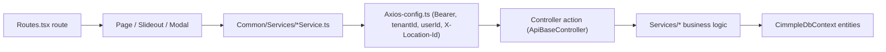
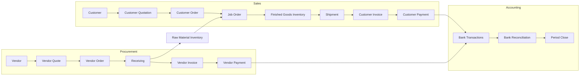

# Cimmple ERP — QA Test Matrix

Test inventory for the Cimmple ERP web application, built from the actual code. This document lists **what to test**; it does not record results or bugs. It is the source for a later `QA_BUGS.md`.

## 0. Scope and conventions

| Item | Value |
| --- | --- |
| Frontend | `Cimmple_UI/src` (React 18 + TypeScript, React Router v5, Redux, axios) |
| Backend | `Cimmple_API/CimmpleAPI` (.NET 7 Web API, EF Core, SQL Server). The request referred to it as "Cimmple_AI". |
| Database | One SQL Server database, entities in `Data/CimmpleDbContext.cs` (100 DbSets). Default schema `CimmpleFlow`; attendance tables in schema `CimmplePunch` (`Data/DbSchema.cs`). |
| Out of scope | `Cimmple_PWA` (shop-floor app), `Cimmple_Punch` (punch kiosk), `Cimmple_VPA`. "Mobile" below means the responsive web UI at 375 / 390 / 430 px. |
| Routes | `Cimmple_UI/src/Common/Routes.tsx` (45 protected routes), `Cimmple_UI/src/App.tsx` (`/login`, `/logout`, `/change-password`, `/vendor/*`, `/support/*`), menu in `Common/Components/Sidebar.tsx` |
| Controllers | 43 files in `Cimmple_API/CimmpleAPI/Controllers` (base: `ApiBaseController.cs`) |

**Status column values:** `Not Tested` (initial), `Pass`, `Fail`, `Blocked`, `N/A`. Every row starts as `Not Tested`.

**Coverage values (summary tables):** `Yes`, `No`, `Partial`, `Needs Review`.

**Abbreviations:** FE = frontend, BE = backend, CO = customer order, CQ = customer quotation, VO = vendor order, VQ = vendor quotation, JO = job order, FG = finished goods, RM = raw material, GL = general ledger, JE = journal entry, AR/AP = accounts receivable/payable, NCR = non-conformance report.

### 0.1 Request path (applies to every module)

### 0.2 Platform facts every tester needs

- **Backend authorization:** `Program.cs` sets a global `FallbackPolicy = RequireAuthenticatedUser`. No ERP controller uses role or permission attributes. Anonymous endpoints: `Auth/Login`, `Auth/VendorLogin`, `Auth/Refresh`, `Auth/IntegrationToken`, `Auth/BootstrapPassword` (Development only), `Employee/GetProfilePic`, `User/UnderMaintenance`.
- **Frontend permissions:** `AuthService.hasPermissionForPath` (exact URL match). Admins (role name matching `/admin/i` or `canAccessAllLocations`) pass everything. A role with zero permissions only reaches `/home`. Used by `Sidebar.tsx` (`filterByPermission`), `ProtectedLayout.tsx` (redirect / "No access"), TopBar settings item, global-search and notification navigation.
- **Tenant resolution:** `ApiBaseController.GetTenantId()` reads the JWT `tenantId` claim, then falls back to the `tenantId` header. Many endpoints also accept `tenantId` in the query string or body (see the Location / Tenant Matrix).
- **Location resolution:**
  - `GetActiveLocationId()` reads `X-Location-Id`, validated against the `locationIds` claim (403 if not allowed).
  - `TryResolveListLocationFilter` is used by lists: an explicit site must be allowed (403). "All sites" means tenant-wide for `canAccessAllLocations` users and the allowed sites for everyone else.
  - `TryResolveLocationId` is used on save: request location, then the header.
  - `CanAccessLocation` is used for per-record checks.
- **Working site switcher:** TopBar, Redux and `localStorage.locationId` (`Common/Hooks/useActiveLocation.ts`). Hidden on `/masters/*`, `/settings`, `/accounts/general-ledger`, `/accounts/periods`, `/quality/ncr-codes` (`Common/Utils/workingSiteVisibility.ts`).
- **List framework:**
  - `MasterListPage`; `useClientPagination` for client paging.
  - `useListPageSize`: default from System Settings `defaultPageSize` (fallback 10), options 10/25/50/100, preference key `listPageSizePref`, reset when the admin default changes.
  - `useColumnChooser`: hidden columns stored in localStorage; locked columns can't be hidden.
  - `useSiteListFilter`: follows the working site, offers "All sites", accepts a `?locationId=` deep link.
- **Deep links:** most list pages accept `?open=<id>`. Some also accept `?search=`, `?status=`, `?startDate=`/`?endDate=`/`?dateRange=`. Global search fires an `openEntity` event.
- **Overlays:** global Esc closes the topmost modal or slideout (`Common/Utils/escapeToClose.ts`). Ctrl/Cmd+K focuses global search (ignored while an overlay is open).

### 0.3 Standard test cases per category

Every module section below lists only its **module-specific** focus. Apply these standard checks to every module where the category is marked applicable in section 9 (Category Applicability Matrix).

| # | Category | Standard checks |
| --- | --- | --- |
| 1 | Navigation | Direct URL; sidebar link; browser back/forward; `?open=<id>` deep link; related-record links (e.g. CO# opens order); global-search open; permission redirect; refresh keeps state |
| 2 | CRUD | Create; view; edit; delete (with impact dialog); duplicate/clone where offered; reopen/restore/void where offered; cancel without saving; unsaved-change prompt |
| 3 | Search | Exact; partial; case-insensitive; numeric (amounts, numbers); formatted numbers (CQ#, CO#, JO#, INV-); date text; no results; special characters; clear search |
| 4 | Filters | Each filter alone; combined filters; date range presets and custom range (start > end); site / All sites; status; clear filters; filter + search; filter + pagination resets to page 1 |
| 5 | Sorting | Each sortable column asc/desc; nulls; numeric vs text sort; sort + filter; sort + pagination (client sort sorts all rows vs current page) |
| 6 | Pagination | Page sizes 10/25/50/100; next/prev; first/last; page number; search + paging; filter + paging; page-size persistence (`listPageSizePref`); admin default change resets preference |
| 7 | Forms | Required; optional; empty; NULL; whitespace-only; invalid format; duplicates; boundary (0, negative, max length, large numbers, decimals); dates (past/future/invalid); dropdowns; multi-selects; double-submit |
| 8 | Validation | Same rule enforced in FE and BE (bypass FE with direct API call); error message text; field highlighting; server 400 body surfaced in toast |
| 9 | Permissions | Menu hidden; route blocked; admin bypass; role with zero permissions; direct API call without UI permission (BE has no role checks); location-restricted user; cross-tenant id |
| 10 | API | React → service → controller → service → DB mapping; correct verb/route; payload shape; headers (`tenantId`, `X-Location-Id`); response shape |
| 11 | Database | Row created/updated/deleted as expected; tenant id stored; location id stored; unique indexes; FK delete behaviour (Cascade / Restrict / SetNull); audit fields |
| 12 | Business logic | Calculations; status transitions; quantity, inventory and financial movements; location and tenant logic |
| 13 | Error handling | API failure; 400 validation; 401 (refresh then login); 403; 404; 409 (period lock); 500; timeout; empty response; network offline; loading and empty states |
| 14 | Documents | Upload; view; download; delete; replace/version; size and extension limits; storage path; links to records; PDF; email |
| 15 | Responsive | Desktop; 375 / 390 / 430 px; touch targets; horizontal table scroll; modals and slideouts fit; sticky actions; Esc / backdrop close; keyboard focus |

---

# 1. Platform modules

## 1.1 Authentication & Session (Login / Logout / Refresh / Idle / Maintenance)

### Frontend

| Test Area | Page/Component | Route | API Used | Status |
| --- | --- | --- | --- | --- |
| Login | `Login/Login.tsx` | `/login` | POST `/Auth/Login` | Not Tested |
| Tenant prompt | `Login.tsx` (Tenant ID shown when error mentions tenant) | `/login` | POST `/Auth/Login` with `tenantId` | Not Tested |
| Logout | `Login/Logout.tsx` | `/logout` | POST `/Auth/Logout` | Not Tested |
| Token refresh | `Common/Services/Axios-config.ts` 401 handler | all | POST `/Auth/Refresh` | Not Tested |
| Current user | `ProtectedLayout.tsx`, `UserAccountModals.tsx` | all | GET `/Auth/Me` | Not Tested |
| Default location | `SystemSettings.tsx` Default Location tab | `/settings` | POST `/Auth/SetDefaultLocation` | Not Tested |
| Idle timeout | `SessionKeepAlive.tsx` (5–480 min, sets `logOutFromIdlePopUp`) | all | — | Not Tested |
| Maintenance | `Login.tsx` → `/Under-Maintenance` | `/login` | GET `/User/UnderMaintenance` | Not Tested |
| Validation | Username and password required | `/login` | — | Not Tested |
| Permissions | `ProtectedLayout.tsx` redirect to landing / login | all | — | Not Tested |
| Responsive | `Login.scss` breakpoint 991.98px | `/login` | — | Not Tested |

### Backend

| Test Area | Controller | Endpoint | Service | Repository/DB | Status |
| --- | --- | --- | --- | --- | --- |
| Login | `AuthController` | POST `Auth/Login` (anonymous) | `Services/Auth/AuthService.cs`, `JwtTokenService` | `UserDetails`, `UserInfo`, `UserLogin`, `UserRole`, `UserMapping`, `PermissionRole`, `PermissionMaster`, `SystemSettings` | Not Tested |
| Refresh | `AuthController` | POST `Auth/Refresh` (anonymous, rotating refresh token) | `AuthService` | `UserDetails.UserToken` | Not Tested |
| Logout | `AuthController` | POST `Auth/Logout` | `AuthService` | `UserInfo` | Not Tested |
| Get | `AuthController` | GET `Auth/Me` | `AuthService` | `UserDetails` | Not Tested |
| Update | `AuthController` | POST `Auth/SetDefaultLocation` | `AuthService` | `UserDetails` | Not Tested |
| Integration | `AuthController` | POST `Auth/IntegrationToken` (anonymous, CimmplePay) | `TokenConfigOptions` | — | Not Tested |
| Dev only | `AuthController` | POST `Auth/BootstrapPassword` (Development) | `AuthService` | `UserDetails` | Not Tested |
| Validation | `AuthController` | 401 bad credentials; 403 vendor account / inactive / locked | `AuthService` | — | Not Tested |
| Authorization | `Program.cs` | JWT bearer, `FallbackPolicy` | — | — | Not Tested |

### Business Logic
- Lockout after `FailedLoginAttempts` (default 5) for `AccountLockoutMinutes` (default 15); `FailedLoginCount`, `LockoutEndUtc` on `UserDetails`.
- `MaxConcurrentSessions` deactivates the oldest `UserInfo` sessions.
- JWT lifetime = `SessionTimeoutMinutes`; refresh token rotated on every refresh; one refresh attempt then redirect to login.
- `mustChangePassword` = user `ChangePassword` Y/Yes OR role `ResetPwd` Y/Yes OR password expired (`PwdResetDate + PasswordExpirationDays`).
- Login response carries permissions (empty list for admins), `locationIds`, `canAccessAllLocations`, default location, timezone.
- Idle logout shows an inactivity message on the login screen.

### Cross-Module Dependencies
- System Settings → Login (lockout, sessions, password expiry, timezone).
- Employee Master → Login (users are created in Employee Master with login access).
- Roles / Permissions → menu and route access after login.
- Location Master + `UserMapping` → `locationIds` claim → every location-scoped list.

### Database
`UserDetails` (PK `User_UniqueID`), `UserInfo`, `UserLogin`, `UserRole`, `UserMapping`, `PermissionMaster`, `PermissionRole`, `SystemSettings`, `UserPasswordHistory`.

---

## 1.2 Password Change / Reset / Policy

### Frontend

| Test Area | Page/Component | Route | API Used | Status |
| --- | --- | --- | --- | --- |
| Change password | `Login/ChangePassword.tsx` | `/change-password` | POST `/Auth/ChangePassword` | Not Tested |
| Forced change redirect | `ProtectedLayout.tsx` | any → `/change-password` | GET `/Auth/Me` | Not Tested |
| Admin reset | `Modules/UserManagement/ResetPasswordModal.tsx` | `/user-management` | POST `/UserManagement/ResetPassword` | Not Tested |
| Email temp password | `ResetPasswordModal.tsx` checkbox (disabled without email) | `/user-management` | POST `/UserManagement/ResetPassword` | Not Tested |
| Validation | `Common/Utils/passwordPolicy.ts` (min length, upper, lower, number, special; confirm match) | both | GET `/SystemSettings/GetSettings` (cached) | Not Tested |
| Permissions | Page reachable only when logged in | `/change-password` | — | Not Tested |
| Responsive | Change password page and modal | — | — | Not Tested |

### Backend

| Test Area | Controller | Endpoint | Service | Repository/DB | Status |
| --- | --- | --- | --- | --- | --- |
| Change | `AuthController` | POST `Auth/ChangePassword` | `AuthService.ChangePasswordAsync`, `ValidatePasswordAgainstPolicy` | `UserDetails`, `UserPasswordHistory` | Not Tested |
| Reset | `UserManagementController` | POST `UserManagement/ResetPassword` | `AuthService` policy, email outbox | `UserDetails`, `EmailOutbox` | Not Tested |
| Validation | both | policy, current password required, not equal to current, not in last `PasswordHistoryCount` | `AuthService` | `UserPasswordHistory` | Not Tested |
| Authorization | both | authenticated only | — | — | Not Tested |

### Business Logic
- Change sets `ChangePassword="N"`, `PwdChangeStatus="Changed"`, records history and trims to `PasswordHistoryCount`.
- Admin reset sets `ChangePassword="Y"`, resets `FailedLoginCount`, clears `LockoutEndUtc` and `UserToken` (forces re-login).
- Role `ResetPwd = Y` makes `mustChangePassword` true at every login. Test whether changing the password clears it.
- Password expiry: login sets `ChangePassword="Y"` when `PwdResetDate + PasswordExpirationDays` is in the past.

### Cross-Module Dependencies
System Settings (Security tab) → policy and expiry; Role Manager (`ResetPwd`) → forced reset; Vendor Master portal password uses the same policy.

### Database
`UserDetails` (`ChangePassword`, `PwdChangeStatus`, `PwdResetDate`, `FailedLoginCount`, `LockoutEndUtc`, `UserToken`), `UserPasswordHistory`, `UserRole.ResetPwd`, `SystemSettings`.

---

## 1.3 User Management (Users)

### Frontend

| Test Area | Page/Component | Route | API Used | Status |
| --- | --- | --- | --- | --- |
| List | `Modules/UserManagement/UserManagement.tsx` | `/user-management` | GET `/UserManagement/GetUsers` | Not Tested |
| Search | Full name, email, username (server, 300ms debounce) | `/user-management` | GET `GetUsers?search` | Not Tested |
| Filter | Status Active/Inactive (server); Site (`useSiteListFilter`) | `/user-management` | GET `GetUsers` | Not Tested |
| Sort | Username, Full Name, Email, Role, Status, Created (client, current page only) | `/user-management` | — | Not Tested |
| Pagination | Server, fixed 10 per page (does not use `useListPageSize`) | `/user-management` | GET `GetUsers?page` | Not Tested |
| Add | Not available here (users created in Employee Master) | — | — | Not Tested |
| Edit | `UserManagementSlideout.tsx` (Role, Status Active/Inactive/Pending) | `?open={id}` | PUT `/UserManagement/UpdateUser` | Not Tested |
| View | Slideout and permission viewer (LevelInfo) | `/user-management` | GET `GetUserById`, `GetPermissionsByRole` | Not Tested |
| Delete | Deactivate (soft) | `/user-management` | DELETE `/UserManagement/DeleteUser` | Not Tested |
| Validation | Role and Status required | slideout | — | Not Tested |
| Permissions | Route `/user-management` permission | — | — | Not Tested |
| Responsive | Table and slideout at 375–430px | — | — | Not Tested |

### Backend

| Test Area | Controller | Endpoint | Service | Repository/DB | Status |
| --- | --- | --- | --- | --- | --- |
| List | `UserManagementController` | GET `GetUsers` (excludes vendor-portal users) | DbContext | `UserDetails`, `UserRole`, `UserMapping` | Not Tested |
| Get | `UserManagementController` | GET `GetUserById` | DbContext | `UserDetails` | Not Tested |
| Update | `UserManagementController` | PUT `UpdateUser` | DbContext | `UserDetails` | Not Tested |
| Delete | `UserManagementController` | DELETE `DeleteUser` (soft) | DbContext | `UserDetails` | Not Tested |
| Legacy | `UserController` | legacy user endpoints, `UnderMaintenance` | `UserRepository` | `UserDetails` | Not Tested |
| Search/Filter | `UserManagementController` | `GetUsers?search&status&locationId&page` | DbContext | — | Not Tested |
| Validation | `UserManagementController` | role exists in tenant | — | — | Not Tested |
| Authorization | — | authenticated only; `tenantId` taken from query/body | — | — | Not Tested |

### Business Logic
- Setting Inactive stamps `Date_of_termination` and the reason; Active clears them.
- Site filter uses `UserMapping`, `DefaultLocationId` or `CanAccessAllLocations`.
- Inactive users cannot log in (403).

### Cross-Module Dependencies
Employee Master (creates users), Roles (assignment), Login (status), Attendance (employee list), Notifications/Conversations (user pickers), NCR investigator/approver pickers.

### Database
`UserDetails`, `UserRole`, `UserMapping`, `PermissionRole`.

---

## 1.4 Roles & Permissions

### Frontend

| Test Area | Page/Component | Route | API Used | Status |
| --- | --- | --- | --- | --- |
| List roles | `RoleManager.tsx` | `/user-management` | GET `/UserManagement/GetRoles` | Not Tested |
| Add role | `RoleManager.tsx` form | — | POST `/UserManagement/CreateRole` | Not Tested |
| Edit role | `RoleManager.tsx` (incl. Reset Password Required) | — | PUT `/UserManagement/UpdateRole` | Not Tested |
| Delete role | `RoleManager.tsx` | — | DELETE `/UserManagement/DeleteRole` | Not Tested |
| Assign permissions | `RolePermissionManager.tsx` | — | GET `GetAllPermissions`, `GetPermissionsByRole`; POST `AssignPermissionsToRole` | Not Tested |
| Clear & Reseed | `RolePermissionManager.tsx` | — | DELETE `ClearPermissions`; POST `SeedPermissions?clearExisting` | Not Tested |
| Menu filtering | `Sidebar.tsx` `filterByPermission` | all | — | Not Tested |
| Route guard | `ProtectedLayout.tsx` | all | — | Not Tested |
| Validation | Role name required | — | — | Not Tested |
| Responsive | Role and permission modals | — | — | Not Tested |

### Backend

| Test Area | Controller | Endpoint | Service | Repository/DB | Status |
| --- | --- | --- | --- | --- | --- |
| List | `UserManagementController` | GET `GetRoles`, `GetAllPermissions`, `GetPermissionsByRole` | DbContext | `UserRole`, `PermissionMaster`, `PermissionRole` | Not Tested |
| Create | `UserManagementController` | POST `CreateRole` | DbContext | `UserRole` | Not Tested |
| Update | `UserManagementController` | PUT `UpdateRole`, POST `AssignPermissionsToRole` (replace all) | DbContext | `UserRole`, `PermissionRole` | Not Tested |
| Delete | `UserManagementController` | DELETE `DeleteRole`, DELETE `ClearPermissions` | DbContext | `UserRole`, `PermissionRole` | Not Tested |
| Seed | `UserManagementController` | POST `SeedPermissions` (45 URL permissions) | DbContext | `PermissionMaster`, `PermissionRole` | Not Tested |
| Validation | `UserManagementController` | name unique per tenant (code check, no index); role in use cannot be deleted; `ResetPwd` normalised Y/N | — | — | Not Tested |
| Authorization | — | no server-side permission enforcement on any endpoint | — | — | Not Tested |

### Business Logic
- Full seed: admin roles get all permissions; other roles get Dashboard only.
- Empty permission list: non-admin user can only reach `/home`.
- Permission match is the exact path; sub-routes (`/accounts/payroll/import`, `/accounts/payroll/manual`) need their own entries.

### Cross-Module Dependencies
Every route; login payload; global search and notification link navigation; Password reset (`ResetPwd`).

### Database
`UserRole`, `PermissionMaster`, `PermissionRole`, `UserDetails.Role`.

---

## 1.5 System Settings

### Frontend

| Test Area | Page/Component | Route | API Used | Status |
| --- | --- | --- | --- | --- |
| View | `Modules/Settings/SystemSettings.tsx` tabs: Default Location, Date & Time, Currency, Security, Email, General | `/settings` | GET `/SystemSettings/GetSettings?tenantId` | Not Tested |
| Edit | Save all tabs | `/settings` | POST `/SystemSettings/SaveSettings` | Not Tested |
| SMTP test | Email tab | `/settings` | POST `/SystemSettings/TestSmtp` | Not Tested |
| Default location | Default Location tab | `/settings` | POST `/Auth/SetDefaultLocation` | Not Tested |
| Validation | Password length 6–20; session timeout 5–480; SMTP port 1–65535; custom SMTP needs server and From | `/settings` | — | Not Tested |
| Permissions | TopBar menu item and route permission | — | — | Not Tested |
| Responsive | Breakpoint 768px | — | — | Not Tested |

### Backend

| Test Area | Controller | Endpoint | Service | Repository/DB | Status |
| --- | --- | --- | --- | --- | --- |
| Get | `SystemSettingsController` | GET `GetSettings`, GET `GetCompanyInfo` (not used by page) | DbContext | `SystemSettings` | Not Tested |
| Update | `SystemSettingsController` | POST `SaveSettings` (upsert one row per tenant), POST `SaveCompanyInfo` | DbContext | `SystemSettings`, `EntityMaster` | Not Tested |
| Test | `SystemSettingsController` | POST `TestSmtp` | email sender | — | Not Tested |
| Validation | `SystemSettingsController` | SMTP password never returned (`HasSmtpPassword`); hosted mode clears tenant SMTP | — | — | Not Tested |
| Authorization | — | authenticated only; tenant from query/body | — | — | Not Tested |

### Business Logic
Settings drive: password policy and expiry, lockout, concurrent sessions, session timeout, `defaultPageSize`, in-app and email notification toggles, timezone (moment default), date and currency formats.

### Cross-Module Dependencies
Login, Password, every list (page size), Notifications, Document Email, Scheduled Reports (email disabled blocks save), AR reminders, Attendance (tenant timezone), Dashboard formatting.

### Database
`SystemSettings` (one row per tenant), `EntityMaster`.

---

## 1.6 Global Search

### Frontend

| Test Area | Page/Component | Route | API Used | Status |
| --- | --- | --- | --- | --- |
| Search | `Common/Components/TopBar.tsx`, `SearchResultsDropdown.tsx` (300ms debounce, 5 per category) | all | GET `/GlobalSearch/Search?query&tenantId&limit` | Not Tested |
| Keyboard | Ctrl/Cmd+K focus (case-insensitive K, ignored while overlay open); Esc clears; Enter opens first result | all | — | Not Tested |
| Navigation | Result opens module with `?open=` / `openEntity`, blocked if no permission | all | — | Not Tested |
| Mentions | Chat @-mention document search | conversations | GET `/GlobalSearch/SearchDocuments` (max 15) | Not Tested |
| No results | Empty state | all | — | Not Tested |
| Responsive | TopBar breakpoint 640px | — | — | Not Tested |

### Backend

| Test Area | Controller | Endpoint | Service | Repository/DB | Status |
| --- | --- | --- | --- | --- | --- |
| Search | `GlobalSearchController` | GET `Search` (26 categories, `Contains`) | DbContext | customers, vendors, quotations, orders, jobs, invoices, shipments, NCRs, users/employees, documents, etc. | Not Tested |
| Search docs | `GlobalSearchController` | GET `SearchDocuments` | DbContext | `Documents` and transactional tables | Not Tested |
| Authorization | — | tenant from query; no location or permission filter on server | — | — | Not Tested |

### Business Logic
Matches name, code, email, phone, document numbers (CO#, PO number, customer PO), EmpCode. Formatted numbers must resolve to the right record.

### Cross-Module Dependencies
Every module that supports `?open=`; Roles/Permissions (navigation block); location (results not filtered by site).

### Database
Read-only across master and transactional tables.

---

## 1.7 Help & Shortcuts / Account Modals / Keyboard

### Frontend

| Test Area | Page/Component | Route | API Used | Status |
| --- | --- | --- | --- | --- |
| Profile | `Common/Components/UserAccountModals.tsx` (profile) | TopBar menu | GET `/Auth/Me`, GET `/Employee/GetProfilePic` | Not Tested |
| Help & Shortcuts | `UserAccountModals.tsx` (help): Ctrl+K (Windows) / Cmd+K (Mac), Esc | TopBar menu | — | Not Tested |
| About | `UserAccountModals.tsx` (about, `APP_VERSION`) | TopBar menu | — | Not Tested |
| Esc to close | `Common/Utils/escapeToClose.ts` (installed in `App.tsx`) | all overlays | — | Not Tested |
| Esc layering | Topmost overlay only; nested popups (mentions, tag picker, step menu, sidebar flyout, search) close first | all | — | Not Tested |
| Esc busy state | Disabled close control → no action | all | — | Not Tested |
| Ctrl/Cmd+K | `TopBar.tsx` | all | — | Not Tested |
| Payroll help | `Modules/Accounting/PayrollJournalsHelp.tsx` | `/accounts/payroll` | — | Not Tested |
| Responsive | Modals at 375–430px | — | — | Not Tested |

### Backend
Only `Auth/Me` and `Employee/GetProfilePic` (anonymous). No other backend.

### Business Logic
- Esc presses the overlay's own close control (`data-esc-close`, `.btn-close`, aria-label/title "Close", × glyph, xmark icon, Close/Cancel text), else clicks the backdrop.
- An overlay is detected as fixed + viewport-covering + overlay-like class, role, aria-modal, body portal, or dimming background.
- Components that handle Esc themselves call `preventDefault`.

### Cross-Module Dependencies
All modals and slideouts across the app (see section 9, Responsive column).

### Database
None.

---

## 1.8 Notifications

### Frontend

| Test Area | Page/Component | Route | API Used | Status |
| --- | --- | --- | --- | --- |
| Bell count | `TopBar.tsx` (polls 45s; excludes chat types) | all | GET `/Notifications/GetUnreadCount` | Not Tested |
| List | TopBar dropdown | all | GET `/Notifications/GetMine?take` (max 100) | Not Tested |
| Mark read | Item click / mark all | all | POST `/Notifications/MarkRead` (`ids` or `markAll`) | Not Tested |
| Send | `Common/Components/NotifyUserDialog.tsx` (recipient, message; subject ≤200, body ≤4000) | slideouts | POST `/Notifications/Send` | Not Tested |
| Disabled state | `EnableInAppNotifications` off | all | — | Not Tested |
| Navigation | Link opens record (permission checked) | all | — | Not Tested |

### Backend

| Test Area | Controller | Endpoint | Service | Repository/DB | Status |
| --- | --- | --- | --- | --- | --- |
| List | `NotificationsController` | GET `GetMine`, `GetUnreadCount` | `NotificationService` | `Notifications` | Not Tested |
| Update | `NotificationsController` | POST `MarkRead` | `NotificationService` | `Notifications` | Not Tested |
| Create | `NotificationsController` | POST `Send` (creates direct message) | `ConversationService` | `Conversations*`, `Notifications`, `EmailOutbox` | Not Tested |
| Authorization | — | tenant/user from JWT, header fallback | — | — | Not Tested |

### Business Logic
Notifications are generated by: comment @mentions, quotation accepted, order shipped, VO fully received, AP approval, job completed, NCR assignment / pending approval / approved / closed, support replies.

### Cross-Module Dependencies
Quotations, Orders, Shipping, Vendor Orders, AP, Job Orders, Quality, Support, Comments.

### Database
`Notifications` (index TenantId, RecipientUserId, IsRead, CreatedAt), `EmailOutbox`.

---

## 1.9 Conversations & Entity Comments

### Frontend

| Test Area | Page/Component | Route | API Used | Status |
| --- | --- | --- | --- | --- |
| Conversation list | `Common/Components/ConversationPanel.tsx` | TopBar | GET `/Conversations/ListMine`, `GetUnreadCount` | Not Tested |
| View thread | `ConversationPanel.tsx` (marks read) | — | GET `/Conversations/Get/{id}` | Not Tested |
| Reply | `ConversationPanel.tsx` (@ people / documents) | — | POST `/Conversations/Reply`, `MarkRead` | Not Tested |
| Comments | `Common/Components/CommentsSection.tsx` in CO, CQ, VO, VQ, JO slideouts | slideouts | PUT `/EntityComments` | Not Tested |
| Mentions | Mention picker (arrow keys, Enter/Tab, Esc) | — | GET `/GlobalSearch/SearchDocuments`, user list | Not Tested |
| Validation | Body required; ≤4000 chars; cannot message self | — | — | Not Tested |

### Backend

| Test Area | Controller | Endpoint | Service | Repository/DB | Status |
| --- | --- | --- | --- | --- | --- |
| List/Get | `ConversationsController` | GET `ListMine`, `GetUnreadCount`, `Get/{id}` | `ConversationService` | `Conversations`, `ConversationParticipants`, `ConversationMessages` | Not Tested |
| Create | `ConversationsController` | POST `Reply`, `MarkRead` | `ConversationService` | same | Not Tested |
| Update comments | `EntityCommentsController` | PUT `/EntityComments` (replaces full list) | `CommentMentionHelper` | `CommentsJson` on record; `VendorOrderComments` | Not Tested |
| Authorization | both | participant check; `CanAccessLocation` (except JobOrder) | — | — | Not Tested |

### Business Logic
Comments save immediately only when `entityId > 0`, otherwise with the parent document. @mentions create `CommentMention` notifications.

### Cross-Module Dependencies
CQ, CO, VQ, VO, JO; Notifications; Documents (mention links).

### Database
`Conversations`, `ConversationParticipants` (unique ConversationId+UserId), `ConversationMessages`, `VendorOrderComments`, `CommentsJson` columns.

---

## 1.10 Support Tickets & Support Staff Portal

### Frontend

| Test Area | Page/Component | Route | API Used | Status |
| --- | --- | --- | --- | --- |
| Create ticket | `Common/Components/ContactSupportDialog.tsx` (floating button, `?supportTicket=`) | all | POST `/SupportTickets/Create` (multipart) | Not Tested |
| List / view | `ContactSupportDialog.tsx` | all | GET `ListMine`, `GetUnreadCount`, `Get/{id}` | Not Tested |
| Reply | `ContactSupportDialog.tsx` | all | POST `Reply` | Not Tested |
| Attachment | Download | all | GET `DownloadAttachment/{id}` | Not Tested |
| Staff login | `SupportStaff/SupportStaffLogin.tsx` | `/support/login` | Support staff auth (`SupportStaffAuth.ts`) | Not Tested |
| Staff inbox | `SupportStaff/SupportInboxPage.tsx` (search `q`, product, status, take 150) | `/support` | `SupportStaffController` endpoints | Not Tested |
| Validation | Subject ≤200, description ≤4000 required; attachment ≤8MB, allowed types | — | — | Not Tested |
| Responsive | Breakpoint 900px | — | — | Not Tested |

### Backend

| Test Area | Controller | Endpoint | Service | Repository/DB | Status |
| --- | --- | --- | --- | --- | --- |
| Client CRUD | `SupportTicketsController` | ListMine, Get, Create, Reply, DownloadAttachment | — | `SupportTickets`, `SupportTicketMessages` | Not Tested |
| Staff | `SupportStaffController` | inbox, reply, status (each checks `IsSupportStaff()`) | `NotificationService`, email | same | Not Tested |
| Validation | both | reply to Closed rejected | — | — | Not Tested |
| Authorization | `SupportStaffController` | `portalType=support`, `tenantId=0`, staff list from config `Support:Staff` | — | — | Not Tested |

### Business Logic
Status: Open → WaitingOnUser (after staff reply) → Resolved → Closed; client reply sets Open; staff reply triggers `SupportReply` notification and email.

### Cross-Module Dependencies
Notifications, Email outbox.

### Database
`SupportTickets`, `SupportTicketMessages`.

---

## 1.11 Vendor Portal

### Frontend

| Test Area | Page/Component | Route | API Used | Status |
| --- | --- | --- | --- | --- |
| Login | `VendorPortal/VendorLogin.tsx` | `/vendor/login` | POST `/Auth/VendorLogin` (`vendorCode`, `password`, `tenantId?`) | Not Tested |
| List | `VendorPortal/VendorDashboard.tsx` (client search) | `/vendor/dashboard` | GET `/Quotation/GetVendorQuotationsByVendorCode` | Not Tested |
| View/Respond | `VendorPortal/VendorQuotationResponse.tsx` | `/vendor/dashboard` | GET `GetVendorQuotationById`; POST `SaveVendorQuotation` | Not Tested |
| Attachments | Line attachments after save | — | POST `VendorQuotationDetailSaveFile`; GET `VendorQuotationGetFile`, `VendorQuotationDetailGetFile` | Not Tested |
| Validation | Unit price required; discount % ≤ 100; locked when Converted/Rejected/Cancelled/Accepted | — | — | Not Tested |
| Session | Separate `vendorToken` / `vendorStorage`; `VendorProtectedLayout.tsx` | `/vendor/*` | — | Not Tested |
| Responsive | Dashboard and response screen | — | — | Not Tested |

### Backend

| Test Area | Controller | Endpoint | Service | Repository/DB | Status |
| --- | --- | --- | --- | --- | --- |
| Login | `AuthController` | POST `VendorLogin` (anonymous) | `AuthService` | `VendorMaster`, `UserDetails.VendorId` | Not Tested |
| List/Get/Update | `QuotationController` | vendor-scoped quotation endpoints (patch-only for portal tokens) | — | `VendorQuotations`, `VendorQuotationsDetails` | Not Tested |
| Authorization | `QuotationController` | scoped by `vendorId` claim + tenant; sent quotations only | — | — | Not Tested |

### Business Logic
Submitting sets status Responded and the server recalculates the total. ERP login with a vendor account returns 403.

### Cross-Module Dependencies
Vendor Master (portal access, `SaveVendorPortalAccess`), Vendor Quotation (send, compare, accept), Notifications.

### Database
`VendorMaster`, `UserDetails`, `VendorQuotations`, `VendorQuotationsDetails`.

---

## 1.12 Tenant / Location Framework & Shared List Components (cross-cutting)

### Frontend

| Test Area | Page/Component | Route | API Used | Status |
| --- | --- | --- | --- | --- |
| Working site switcher | `TopBar.tsx`, `useActiveLocation.ts` (sites and warehouses only) | ERP routes | `/Location/GetLocations` | Not Tested |
| Switcher visibility | `workingSiteVisibility.ts` | hidden on masters, settings, GL, periods, NCR codes | — | Not Tested |
| Headers | `Axios-config.ts` (Bearer, `Username`, `tenantId`, `userId`, `X-Location-Id`) | all | — | Not Tested |
| Site filter | `useSiteListFilter.ts` (All sites, `?locationId=`) | lists | — | Not Tested |
| Page size | `useListPageSize.ts` | lists | GET `/SystemSettings/GetSettings` | Not Tested |
| Client paging | `useClientPagination.ts` | lists | — | Not Tested |
| Column chooser | `useColumnChooser.ts` | lists | — | Not Tested |
| Delete impact | `DeletionImpactDialog.tsx` (canDelete, blockers, cascade "Delete All") | masters, transactions | `Check*DeletionImpact` endpoints | Not Tested |
| CSV import | `Common/Utils/CsvImport.ts` + import modals | masters | `Import*` endpoints | Not Tested |
| Responsive | Layout 1024px; TopBar 640px | all | — | Not Tested |

### Backend

| Test Area | Controller | Endpoint | Service | Repository/DB | Status |
| --- | --- | --- | --- | --- | --- |
| Tenant | `ApiBaseController` | `GetTenantId()`, `GetUserId()` (claim then header) | — | — | Not Tested |
| Location | `ApiBaseController` | `GetActiveLocationId`, `TryResolveListLocationFilter`, `TryResolveLocationId`, `CanAccessLocation` | — | `UserMapping`, `Locations` | Not Tested |
| Authorization | `Program.cs` | FallbackPolicy authenticated user | — | — | Not Tested |

### Business Logic
"All sites" for a restricted user = allowed sites only; explicit disallowed site = 403; working site change refreshes lists; deep-link `?locationId=0` = All sites.

### Cross-Module Dependencies
Every list and every save that stores a location.

### Database
`Locations`, `UserMapping`, `UserDetails.DefaultLocationId`, `UserDetails.CanAccessAllLocations`.

---

# 2. Master data modules

Common to all masters:
- Pagination is client-side (`useClientPagination` + `useListPageSize`), except Job Template, which pages on the server.
- The working site switcher is hidden on `/masters/*`.
- Only Bank and Employee lists apply the site filter on the server.
- The backend has no role checks, and the tenant comes from the request (query or body).

## 2.1 Customer Master

### Frontend

| Test Area | Page/Component | Route | API Used | Status |
| --- | --- | --- | --- | --- |
| List | `Modules/Masters/CustomerMaster.tsx` | `/masters/customer` | GET `/Customer/GetCustomerlist` | Not Tested |
| Search | Code, name, address, phone (client) | `/masters/customer` | — | Not Tested |
| Filter | Status Active/Inactive (client) | `/masters/customer` | — | Not Tested |
| Sort | All columns (client) | `/masters/customer` | — | Not Tested |
| Pagination | Client, `useListPageSize` | `/masters/customer` | — | Not Tested |
| Add | `CustomerMasterSlideout.tsx` (contacts, billing, shipping addresses) | `/masters/customer` | POST `/Customer/SaveCustomerData` | Not Tested |
| Edit | `CustomerMasterSlideout.tsx` | `?open=` | GET `GetCustomerById`; POST `SaveCustomerData` | Not Tested |
| View | Slideout | — | GET `GetCustomerById` | Not Tested |
| Delete | `DeletionImpactDialog` incl. "Delete All (Dependencies + Order)" | — | GET `CheckCustomerDeletionImpact`; DELETE `DeleteCustomer` | Not Tested |
| Import | `CustomerMasterImportModal.tsx` (template, preview, in-file duplicates) | — | POST `/Customer/ImportCustomers` | Not Tested |
| Validation | Company name required; email, phone, zip format (incl. contacts) | — | — | Not Tested |
| Permissions | `/masters/customer` | — | — | Not Tested |
| Responsive | List, slideout, import modal | — | — | Not Tested |

### Backend

| Test Area | Controller | Endpoint | Service | Repository/DB | Status |
| --- | --- | --- | --- | --- | --- |
| List | `CustomerController` | GET `GetCustomerlist` | DbContext | `CustomerMaster` | Not Tested |
| Get | `CustomerController` | GET `GetCustomerById` | DbContext | `CustomerMaster`, `CustomerContact`, `CustomerBillingAddress`, `CustomerShippingAddressNew` | Not Tested |
| Create/Update | `CustomerController` | POST `SaveCustomerData` | `MasterCodeGenerator` (prefix C) | same | Not Tested |
| Delete | `CustomerController` | GET `CheckCustomerDeletionImpact`; DELETE `DeleteCustomer` (hard) | — | same | Not Tested |
| Import | `CustomerController` | POST `ImportCustomers` (`UpdateExisting`, `StopOnError`) | CSV import | same | Not Tested |
| Validation | `CustomerController` | company name unique per tenant (case-insensitive, trimmed) | — | no DB unique index | Not Tested |
| Authorization | — | authenticated; tenant from request | — | — | Not Tested |

### Business Logic
- Auto code `C…`.
- Delete is blocked by orders, quotations, invoices and shipments. "Delete All" cascades through the Order, Quotation, Invoice and Shipping services.
- Contacts and addresses are deleted with the customer.
- Status is a string, "Active" or "Inactive".

### Cross-Module Dependencies
Customer → Quotation → Order → Shipment → Invoice → AR/Payments; Customer → NCR (customer source); Product (parts by customer); Reports (customer reports); Dashboard (top customers); Document email default recipient.

### Database
`CustomerMaster`, `CustomerContact`, `CustomerBillingAddress`, `CustomerShippingAddressNew`.

---

## 2.2 Vendor Master

### Frontend

| Test Area | Page/Component | Route | API Used | Status |
| --- | --- | --- | --- | --- |
| List | `VendorMaster.tsx` | `/masters/vendor` | GET `/Vendor/GetVendorlist` | Not Tested |
| Search / Filter / Sort / Pagination | Same pattern as Customer (client) | `/masters/vendor` | — | Not Tested |
| Add / Edit / View | `VendorMasterSlideout.tsx` (contacts, COA mapping, portal access) | `?open=` | GET `/Vendor/GetVendorById`; POST `/Vendor/SaveVendorData` | Not Tested |
| Portal access | Vendor portal password + confirm | slideout | POST `/Vendor/SaveVendorPortalAccess` | Not Tested |
| Delete | `DeletionImpactDialog` with Delete All | — | GET `/Vendor/CheckVendorDeletionImpact`; DELETE `/Vendor/DeleteVendor` | Not Tested |
| Import | `VendorMasterImportModal.tsx` | — | POST `/Vendor/ImportVendors` | Not Tested |
| Validation | Vendor name required; portal password policy and confirm match | — | — | Not Tested |
| Permissions | `/masters/vendor` | — | — | Not Tested |
| Responsive | List, slideout | — | — | Not Tested |

### Backend

| Test Area | Controller | Endpoint | Service | Repository/DB | Status |
| --- | --- | --- | --- | --- | --- |
| List/Get | `VendorController` | GET `GetVendorlist`, `GetVendorById` | DbContext | `VendorMaster`, `VendorContact`, `VendorCOAMapping` | Not Tested |
| Create/Update | `VendorController` | POST `SaveVendorData` (code prefix V) | `MasterCodeGenerator` | same | Not Tested |
| Portal | `VendorController` | POST `SaveVendorPortalAccess` | `IAuthService` (policy, history) | `UserDetails` | Not Tested |
| Delete | `VendorController` | GET `CheckVendorDeletionImpact`; DELETE `DeleteVendor` (portal user set Inactive) | — | same | Not Tested |
| Import | `VendorController` | POST `ImportVendors` | CSV import | same | Not Tested |
| Validation | `VendorController` | name unique per tenant | — | — | Not Tested |
| Authorization | — | authenticated; tenant from request | — | — | Not Tested |

### Business Logic
Delete is blocked by vendor orders, vendor quotations, vendor invoices and receiving. The portal login requires an active vendor.

### Cross-Module Dependencies
Vendor → VQ → VO → Receiving → Vendor Invoice → AP/Payments; Raw Material (`VendorId`); Vendor Portal; NCR (external source vendor); Reports (vendor performance).

### Database
`VendorMaster`, `VendorContact`, `VendorCOAMapping`, `UserDetails` (portal).

---

## 2.3 Employee Master (incl. face enrolment)

### Frontend

| Test Area | Page/Component | Route | API Used | Status |
| --- | --- | --- | --- | --- |
| List | `EmployeeMaster.tsx` ("Face Enrolled" column) | `/masters/employee` | GET `/Employee/GetEmployees?locationId` | Not Tested |
| Search / Sort / Pagination | Client | — | — | Not Tested |
| Filter | Site filter (server) | — | — | Not Tested |
| Add / Edit | `EmployeeMasterSlideout.tsx` (login access, role, locations, workstations, photo) | `?open=` | POST `SaveEmployee` (JSON) / `SaveEmployeeData` (multipart `file` + `formField`); GET `GetAllRoles` | Not Tested |
| View | Slideout; profile picture | — | GET `GetEmployeeById`, `GetProfilePic` | Not Tested |
| Face enrolment | Photo upload → `faceEnrolled` / `faceMessage` toast | — | `SaveEmployeeData` | Not Tested |
| Delete | `DeletionImpactDialog` (warnings only) | — | impact + delete | Not Tested |
| Import | `EmployeeMasterImportModal.tsx` (duplicate emp code / username / email in file) | — | POST `ImportEmployees` | Not Tested |
| Validation | FirstName, LastName, EmpCode required; login access needs password meeting policy | — | — | Not Tested |
| Permissions | `/masters/employee` | — | — | Not Tested |
| Responsive | List, slideout | — | — | Not Tested |

### Backend

| Test Area | Controller | Endpoint | Service | Repository/DB | Status |
| --- | --- | --- | --- | --- | --- |
| List | `EmployeeController` | GET `GetEmployees` (`TryResolveListLocationFilter`) | DbContext | `UserDetails`, `UserMapping` | Not Tested |
| Get | `EmployeeController` | GET `GetEmployeeById`, `GetProfilePic` (anonymous) | — | `UserDetails` | Not Tested |
| Create/Update | `EmployeeController` | POST `SaveEmployee`, `SaveEmployeeData` | `FaceRecognitionService.EnrollFromBytesAsync`, `IAuthService` | `UserDetails`, `UserMapping`, `UserWorkstationMapping`, `EmployeeFace` | Not Tested |
| Delete | `EmployeeController` | impact, delete | — | removes mappings | Not Tested |
| Import | `EmployeeController` | POST `ImportEmployees` | — | `UserDetails` | Not Tested |
| Validation | `EmployeeController` | username unique per tenant; EmpCode unique per tenant (case-insensitive) | — | — | Not Tested |
| Authorization | — | authenticated; `GetProfilePic` anonymous | — | — | Not Tested |

### Business Logic
- A failed face enrolment still saves the photo and shows a warning.
- Delete is never blocked; it warns that created-by references on orders, JOs and VOs are lost.
- Location mapping controls which sites the user can access (the `locationIds` claim).

### Cross-Module Dependencies
Employee → Login/User Management; → Attendance (punch, face); → Workstation mapping; → JO steps / NCR investigator/approver; → `UserMapping` drives location access everywhere.

### Database
`UserDetails`, `UserMapping`, `UserWorkstationMapping`, `CimmplePunch.EmployeeFace` (unique TenantId+UserUniqueId).

---

## 2.4 Location Master

### Frontend

| Test Area | Page/Component | Route | API Used | Status |
| --- | --- | --- | --- | --- |
| List | `LocationMaster.tsx` | `/masters/location` | GET `/Location/GetLocations` | Not Tested |
| Search | 11 fields (client) | — | — | Not Tested |
| Filter | All / active / inactive | — | — | Not Tested |
| Sort / Pagination | Client | — | — | Not Tested |
| Add / Edit | `LocationMasterSlideout.tsx` (type, parent, address) | `?open=` | GET `GetLocationById`; POST `SaveLocation` | Not Tested |
| Logo | Business sites only, jpg/jpeg/png/gif/svg ≤5MB | slideout | POST `UploadLogo`; DELETE `DeleteLogo` | Not Tested |
| Delete | `DeletionImpactDialog` | — | `CheckLocationDeletionImpact`, `DeleteLocation` | Not Tested |
| Validation | Code, Name required (UI only); valid parent/child type | — | — | Not Tested |
| Permissions | `/masters/location` | — | — | Not Tested |
| Responsive | List, slideout | — | — | Not Tested |

### Backend

| Test Area | Controller | Endpoint | Service | Repository/DB | Status |
| --- | --- | --- | --- | --- | --- |
| List/Get | `LocationController` | GET `GetLocations`, `GetLocationById` | DbContext | `Locations` | Not Tested |
| Create/Update | `LocationController` | POST `SaveLocation` | `LocationKind.IsValidParentChild` | `Locations` | Not Tested |
| Logo | `LocationController` | `UploadLogo`, `DeleteLogo` | storage | `LogoAttachment` | Not Tested |
| Delete | `LocationController` | impact, delete (removes `UserMapping`) | — | `Locations` (parent FK Restrict) | Not Tested |
| Validation | `LocationController` | parent can't change after create; top level = BusinessSite; no code uniqueness check | — | — | Not Tested |
| Authorization | — | authenticated | — | — | Not Tested |

### Business Logic
Delete is blocked by child locations, `InventoryBalance`, `InventoryLotBalance` and `InventoryTransaction`. The location logo is used in PDF letterheads.

### Cross-Module Dependencies
Location → working site switcher, `UserMapping`, inventory balances/transfers, orders/quotes/VOs (`locationId`), bank master, documents, PDF letterhead, reports by location, attendance.

### Database
`Locations` (PK `LocationId`, self FK `ParentLocationId` Restrict, index TenantId+ParentLocationId), `LogoAttachment`.

---

## 2.5 Workstation Master

### Frontend

| Test Area | Page/Component | Route | API Used | Status |
| --- | --- | --- | --- | --- |
| List | `WorkstationMaster.tsx` | `/masters/workstation` | GET `/Workstation/GetWorkstations` | Not Tested |
| Search / Filter / Sort / Pagination | Client | — | — | Not Tested |
| Add / Edit | `WorkstationMasterSlideout.tsx` (user mapping) | `?open=` | GET `GetWorkstationById`, `GetUserWorkstationMapping`, `GetAllUsers`; POST `SaveWorkstation` | Not Tested |
| Delete | `DeletionImpactDialog` | — | GET `CheckWorkstationDeletionImpact`; DELETE `DeleteWorkstation` | Not Tested |
| Import | `WorkstationMasterImportModal.tsx` (WorkstationName, Status) | — | POST `ImportWorkstations` | Not Tested |
| Validation | Name required | — | — | Not Tested |
| Permissions / Responsive | `/masters/workstation` | — | — | Not Tested |

### Backend

| Test Area | Controller | Endpoint | Service | Repository/DB | Status |
| --- | --- | --- | --- | --- | --- |
| CRUD | `WorkstationController` | list, get, save (replaces user mappings), delete | DbContext | `WorkstationMaster`, `UserWorkstationMapping` | Not Tested |
| Import | `WorkstationController` | import | — | same | Not Tested |
| Validation | `WorkstationController` | name unique per tenant (case-insensitive) | — | — | Not Tested |
| Authorization | — | authenticated | — | — | Not Tested |

### Business Logic
Deactivating or deleting is blocked if the workstation is used as a process default, in job template header/operations, or in JO `RoutingStepsJson`.

### Cross-Module Dependencies
Workstation → Process (default) → Job Template → Job Orders (routing) → reports (workstation utilization).

### Database
`WorkstationMaster` (`IsActive`), `UserWorkstationMapping`.

---

## 2.6 Process Master

### Frontend

| Test Area | Page/Component | Route | API Used | Status |
| --- | --- | --- | --- | --- |
| List | `ProcessMaster.tsx` | `/masters/process` | GET `/Process/GetProcesses` | Not Tested |
| Filter | All / active / inactive / outside (`isFixed`) | — | — | Not Tested |
| Search / Sort / Pagination | Client | — | — | Not Tested |
| Add / Edit | `ProcessMasterSlideout.tsx` (category from `PROCESS_CATEGORIES`, default workstation, est. time, cost/hr) | `?open=` | GET `GetProcessById`; POST `SaveProcess` | Not Tested |
| Delete | `DeletionImpactDialog` | — | GET `CheckProcessDeletionImpact`; DELETE `DeleteProcess` | Not Tested |
| Import | `ProcessMasterImportModal.tsx` | — | POST `ImportProcesses` | Not Tested |
| Validation | Name required; est. time and cost/hr ≥ 0 | — | — | Not Tested |
| Permissions / Responsive | `/masters/process` | — | — | Not Tested |

### Backend

| Test Area | Controller | Endpoint | Service | Repository/DB | Status |
| --- | --- | --- | --- | --- | --- |
| CRUD | `ProcessController` | list, get, save, delete, `GetProcessCategories` (unused by UI) | DbContext | `ProcessMaster` | Not Tested |
| Import | `ProcessController` | import | — | `ProcessMaster` | Not Tested |
| Validation | `ProcessController` | name unique per tenant; code unique if given; default workstation must exist | — | non-unique indexes (Tenantid, ProcessName/ProcessCode) | Not Tested |
| Authorization | — | authenticated | — | — | Not Tested |

### Business Logic
`StandardCostPerHour` is decimal(18,2). System processes (`IsSystem`) can't be deleted or deactivated. Also blocked when used by job templates or JO routing JSON.

### Cross-Module Dependencies
Process → Job Template operations → Job Orders routing → reports (process performance, production efficiency).

### Database
`ProcessMaster`.

---

## 2.7 Job Template Master

### Frontend

| Test Area | Page/Component | Route | API Used | Status |
| --- | --- | --- | --- | --- |
| List | `JobTemplateMaster.tsx` | `/masters/jobtemplate` | GET `GetJobTemplates` | Not Tested |
| Search | Code, name, description (server) | — | `search` | Not Tested |
| Filter | Status; category facets (OR within type, AND across types, `matchMode=any`) | — | `status`, `categoryIds`, `matchMode` | Not Tested |
| Sort | Server `sortBy` / `sortDir` | — | — | Not Tested |
| Pagination | Server `page` / `pageSize` | — | — | Not Tested |
| Export | CSV via `pageSize=0` | — | — | Not Tested |
| Add / Edit | `JobTemplateMasterSlideout.tsx` (operations, materials, categories, attachments) | `?open=` | GET by id; POST `SaveJobTemplate` | Not Tested |
| Clone | New code required | — | POST `CloneJobTemplate` | Not Tested |
| Attachments | ≤25MB, allowed extensions | — | POST `UploadJobTemplateAttachment`; DELETE `DeleteJobTemplateAttachment` | Not Tested |
| Delete | `DeletionImpactDialog` | — | impact, delete | Not Tested |
| Validation | Code, name required; revision ≥1; Effective To ≥ From; ≥1 operation with process; sequence positive and unique | — | — | Not Tested |
| Permissions / Responsive | `/masters/jobtemplate` | — | — | Not Tested |

### Backend

| Test Area | Controller | Endpoint | Service | Repository/DB | Status |
| --- | --- | --- | --- | --- | --- |
| List/Get | `JobTemplateController` | GET `GetJobTemplates`, `GetJobTemplateById` | DbContext | `JobTemplateMaster`, `JobTemplateOperation`, `JobTemplateMaterial`, `JobTemplateCategory`, `JobTemplateAttachment` | Not Tested |
| Create/Update | `JobTemplateController` | POST `SaveJobTemplate`, `CloneJobTemplate` | — | same | Not Tested |
| Delete | `JobTemplateController` | impact, delete (cascades operations, materials, tags, files) | — | same | Not Tested |
| Files | `JobTemplateController` | upload/delete attachment (`wwwroot/uploads/jobtemplates/{tenant}/{id}`) | — | `JobTemplateAttachment` | Not Tested |
| Validation | `JobTemplateController` | code unique; process ids exist; sequence rules | — | unique (Tenantid, TemplateCode); unique (JobTemplateId, SequenceNumber) | Not Tested |
| Authorization | — | authenticated | — | — | Not Tested |

### Business Logic
- Routing total = setup minutes + cycle minutes.
- Operations are renumbered in steps of 10.
- System templates can't be deleted.
- Existing JOs are unaffected by template changes.

### Cross-Module Dependencies
Job Template ← Process, Workstation, Product, Raw Material, Category; → Job Orders (apply template, save JO as template).

### Database
`JobTemplateMaster`, `JobTemplateOperation` (Cascade), `JobTemplateMaterial` (Cascade; Product/RawMaterial Restrict), `JobTemplateCategory` (unique JobTemplateId+CategoryValueId; CategoryValue Restrict), `JobTemplateAttachment` (Cascade).

---

## 2.8 Product Master

### Frontend

| Test Area | Page/Component | Route | API Used | Status |
| --- | --- | --- | --- | --- |
| List | `ProductMaster.tsx` | `/masters/product` | GET `GetProductMasterList`, `GetProductsFromOrders` | Not Tested |
| Search | partNo, partName, unit (client) | — | — | Not Tested |
| Sort | Aggregate columns: quantities, avg price, counts, last ordered | — | — | Not Tested |
| Pagination | Client | — | — | Not Tested |
| Sync | "Sync from orders" | — | POST `SyncFromOrders` | Not Tested |
| View / Edit | `ProductMasterSlideout.tsx` (reorder policy only when `source === "ProductMaster"`) | — | GET `GetProductById?partNo`; POST `SaveReorderPolicy` | Not Tested |
| Add / Delete | Not available (derived from orders/quotes) | — | — | Not Tested |
| Validation | Reorder point/qty numeric | — | — | Not Tested |
| Permissions / Responsive | `/masters/product` | — | — | Not Tested |

### Backend

| Test Area | Controller | Endpoint | Service | Repository/DB | Status |
| --- | --- | --- | --- | --- | --- |
| List/Get | `ProductMasterController` | list, from orders, by part, `GetPartsByCustomer`, `GetPartsByVendor` | DbContext | `ProductMaster`, order/quote details | Not Tested |
| Sync | `ProductMasterController` | POST `SyncFromOrders` (Make+Buy → Both) | `ProductSourcing` | `ProductMaster` | Not Tested |
| Update | `ProductMasterController` | POST `SaveReorderPolicy` | — | `ProductMaster`, `InventoryBalance` | Not Tested |
| Authorization | — | authenticated | — | — | Not Tested |

### Business Logic
Sync never duplicates part numbers. FG products are also auto-created by job completion, shipments and VO receiving (`ProductSourcing.EnsureFinishedProductAsync`).

### Cross-Module Dependencies
Product ← CQ/CO/VO lines; → Inventory balances, low stock alerts; → Job Template materials; → reports (product revenue, inventory valuation).

### Database
`ProductMaster`, `PartBreakupSetup` (Needs Review), `InventoryBalance`.

---

## 2.9 Raw Material Master

### Frontend

| Test Area | Page/Component | Route | API Used | Status |
| --- | --- | --- | --- | --- |
| List | `RawMaterialMaster.tsx` (inline editor; "Show inactive") | `/masters/raw-material` | GET `/Inventory/GetRawMaterials?includeInactive` | Not Tested |
| Search / Sort / Pagination | Client | — | — | Not Tested |
| Add / Edit | Inline (vendor, default location, parent remnant, reorder) | — | POST `/Inventory/SaveRawMaterial`; loads Location, Vendor lists | Not Tested |
| Deactivate | Toggle | — | POST `/Inventory/SetRawMaterialStatus` | Not Tested |
| Delete | Not available | — | — | Not Tested |
| Validation | PartNo, PartName, Unit required | — | — | Not Tested |
| Permissions / Responsive | `/masters/raw-material` | — | — | Not Tested |

### Backend

| Test Area | Controller | Endpoint | Service | Repository/DB | Status |
| --- | --- | --- | --- | --- | --- |
| List | `InventoryController` | GET `GetRawMaterials` | `InventoryService` | `RawMaterialMaster` | Not Tested |
| Create/Update | `InventoryController` | POST `SaveRawMaterial` (copies reorder to `InventoryBalance`) | — | `RawMaterialMaster`, `InventoryBalance` | Not Tested |
| Status | `InventoryController` | POST `SetRawMaterialStatus` (blocked with on-hand or reserved stock) | — | — | Not Tested |
| Validation | `InventoryController` | PartNo unique per tenant; SKU unique if given; vendor in tenant; parent ≠ self; default location active | — | index (Tenantid, PartNo) | Not Tested |
| Authorization | — | authenticated | — | — | Not Tested |

### Business Logic
Remnants are created on issue with an offcut (`{part}-R{n}`). Raw materials are auto-created by VO receiving (`RawMaterialCatalog.EnsureAsync`).

### Cross-Module Dependencies
Raw Material → Inventory, Job materials (reserve/issue, shortage), Job Template materials, VO lines, reports (material usage/cost).

### Database
`RawMaterialMaster` (parent FK Restrict, DefaultLocation SetNull).

---

## 2.10 Category Master (Category Types and Values)

### Frontend

| Test Area | Page/Component | Route | API Used | Status |
| --- | --- | --- | --- | --- |
| List types | `CategoryMaster.tsx` | `/masters/category` | GET `GetCategoryTypes`, POST `EnsureDefaultCategoryTypes` | Not Tested |
| Add / Edit type | `CategoryTypeSlideout.tsx` (AllowUserValues, IsActive, DisplayOrder) | — | POST `SaveCategoryType` | Not Tested |
| Delete type | — | — | DELETE `DeleteCategoryType` | Not Tested |
| Values | List, search (server), add, delete | — | GET `GetCategoryValues?search`; POST `SaveCategoryValue`; DELETE `DeleteCategoryValue` | Not Tested |
| Tag picker | `CategoryTagInput.tsx` (create only if `allowCreate` and `allowUserValues`) | JT slideout | `SaveCategoryValue` | Not Tested |
| Validation / Permissions / Responsive | — | — | — | Not Tested |

### Backend

| Test Area | Controller | Endpoint | Service | Repository/DB | Status |
| --- | --- | --- | --- | --- | --- |
| CRUD | `CategoryController` | types and values endpoints | DbContext | `CategoryType`, `CategoryValue` | Not Tested |
| Validation | `CategoryController` | duplicate value returns existing (`existed=true`); rejected if type disallows user values; system types undeletable; used by job templates undeletable | — | unique (Tenantid, Name); unique (CategoryTypeId, Name); values Cascade | Not Tested |
| Authorization | — | authenticated | — | — | Not Tested |

### Cross-Module Dependencies
Category → Job Template tags and filters.

### Database
`CategoryType`, `CategoryValue`, `JobTemplateCategory`. Legacy `Category`, `ProductType` (Needs Review).

---

## 2.11 Price Breakdown Master

### Frontend

| Test Area | Page/Component | Route | API Used | Status |
| --- | --- | --- | --- | --- |
| List / inline grid | `PriceBreakdownMaster.tsx` (bulk save) | `/masters/pricebreakdown` | GET `GetPriceBreakdowns` | Not Tested |
| Edit | `PriceBreakdownMasterSlideout.tsx` | — | GET `GetPriceBreakdownById` | Not Tested |
| Save all | Bulk save | — | POST `SavePriceBreakdowns` (full list) | Not Tested |
| Validation | ItemName required; duplicate names rejected (UI) | — | — | Not Tested |
| Permissions / Responsive | `/masters/pricebreakdown` | — | — | Not Tested |

### Backend

| Test Area | Controller | Endpoint | Service | Repository/DB | Status |
| --- | --- | --- | --- | --- | --- |
| List/Get | `PriceBreakdownController` | GET list, by id | DbContext | `PriceBreakdownMaster` | Not Tested |
| Save | `PriceBreakdownController` | POST `SavePriceBreakdowns` (rows missing from list are hard-deleted) | — | `PriceBreakdownMaster` | Not Tested |
| Authorization | — | authenticated | — | — | Not Tested |

### Cross-Module Dependencies
Price Breakdown → Customer Quotation price breakdown matrix popup (active items only).

### Database
`PriceBreakdownMaster` (ItemName, Srno, Status).

---

## 2.12 Bank Master

### Frontend

| Test Area | Page/Component | Route | API Used | Status |
| --- | --- | --- | --- | --- |
| List | `BankMaster.tsx` (`MasterListPage`, masked account numbers) | `/masters/bank` | GET `/Bank/GetBanklist?locationId` | Not Tested |
| Filter | Active/Inactive; site filter | — | — | Not Tested |
| Add / Edit | `BankMasterSlideout.tsx` | `?open=` | GET `GetBankById`; POST `SaveBankData` | Not Tested |
| Delete | `DeletionImpactDialog` with Delete All | — | `CheckBankDeletionImpact`, `DeleteBank` | Not Tested |
| Validation | BankName, AccountNo (create), NickName, startingcheck, checkseries required; COA exactly 4 chars | — | — | Not Tested |
| Permissions / Responsive | `/masters/bank` | — | — | Not Tested |

### Backend

| Test Area | Controller | Endpoint | Service | Repository/DB | Status |
| --- | --- | --- | --- | --- | --- |
| List | `BankController` | GET `GetBanklist` (`TryResolveListLocationFilter`; opening and current balance) | DbContext | `BankMaster`, `Transactions` | Not Tested |
| Create/Update | `BankController` | POST `SaveBankData` (`TryResolveLocationId`; 403 inaccessible location) | — | `BankMaster` | Not Tested |
| Delete | `BankController` | impact, delete | — | `BankMaster` | Not Tested |
| Validation | `BankController` | AccountNo/RoutingNo unique within location; COA unique | — | — | Not Tested |
| Authorization | — | authenticated; location access | — | — | Not Tested |

### Business Logic
- Location-scoped.
- Delete is blocked by `BankCOAMapping`, `Transactions`, `InvoiceMaster` and `VendorInvoiceMaster`.
- Active banks must have a completed reconciliation before period close (tenant-wide check).

### Cross-Module Dependencies
Bank → customer/vendor/payroll payments, Bank Reconciliation, Period Close, Payment Dashboard, Accounting Setup (payroll bank).

### Database
`BankMaster`, `BankCOAMapping`.

---

## 2.13 Credit Card Master

### Frontend

| Test Area | Page/Component | Route | API Used | Status |
| --- | --- | --- | --- | --- |
| List | `CreditCardMaster.tsx` | `/masters/creditcard` | GET `/CreditCard/GetCreditCards` | Not Tested |
| Search / Sort | Number, holder, type, nickname (client) | — | — | Not Tested |
| Add / Edit | `CreditCardMasterSlideout.tsx` (IsPrimary, COA) | `?open=` | GET `GetCreditCardById`; POST `SaveCreditCard` | Not Tested |
| Delete | `DeletionImpactDialog` | — | `CheckCreditCardDeletionImpact`, `DeleteCreditCard` | Not Tested |
| Validation | CardholderName, CardNumber (create) required; `validateCardNumber`, `validateCVV`, `validateExpiryDate`, email/phone/zip | — | — | Not Tested |
| Permissions / Responsive | `/masters/creditcard` | — | — | Not Tested |

### Backend

| Test Area | Controller | Endpoint | Service | Repository/DB | Status |
| --- | --- | --- | --- | --- | --- |
| CRUD | `CreditCardController` | list, get, save, impact (always `CanDelete=true`), delete (hard) | DbContext | `CreditCardMaster` | Not Tested |
| Authorization | — | authenticated | — | — | Not Tested |

### Business Logic
`LastFourDigits` is derived after stripping spaces and dashes. Status is 1/0.

### Cross-Module Dependencies
Chart of Accounts (COA link; COA delete blocked by credit card).

### Database
`CreditCardMaster`.

---

## 2.14 Chart of Accounts Master

### Frontend

| Test Area | Page/Component | Route | API Used | Status |
| --- | --- | --- | --- | --- |
| List | `ChartofAccountsMaster.tsx` (`MasterListPage`) | `/masters/chartofaccounts` | GET `/ChartofAccounts/GetChartofAccounts` | Not Tested |
| Filter | Active/Inactive | — | — | Not Tested |
| Add / Edit | `ChartofAccountsMasterSlideout.tsx` (inline group creation, 4 levels) | `?open=` | GET `GetChartofAccountById`, `GetMainGroups`, `GetSubGroups`, `GetSubGroups2`, `GetSubGroups3`; POST `SaveChartofAccount`, `SaveMainGroup`, `SaveSubGroup`, `SaveSubGroup2`, `SaveSubGroup3` | Not Tested |
| Delete | `DeletionImpactDialog` | — | GET `CheckChartofAccountDeletionImpact`; DELETE `DeleteChartofAccount` | Not Tested |
| Validation | AccountCode, AccountName required | — | — | Not Tested |
| Permissions / Responsive | `/masters/chartofaccounts` | — | — | Not Tested |

### Backend

| Test Area | Controller | Endpoint | Service | Repository/DB | Status |
| --- | --- | --- | --- | --- | --- |
| CRUD | `ChartofAccountsController` | accounts and group endpoints | DbContext | `ChartofAccounts`, `MainGroup`, `SubGroup`, `SubGroup2`, `SubGroup3`, `COARowtitle` | Not Tested |
| Validation | `ChartofAccountsController` | delete blocked by Bank, CreditCard, BankCOAMapping, VendorCOAMapping, Deposits, Withdrawals, JournalEntries/From/To, TransCoa | — | — | Not Tested |
| Authorization | — | authenticated | — | — | Not Tested |

### Cross-Module Dependencies
COA → JE lines, Accounting Setup defaults (AR, AP, revenue, tax, freight, payroll), Financial Reports, GL activity, invoices (GL resolution), vendor order line `glcode`.

### Database
`ChartofAccounts` (`IsActive`), `MainGroup`, `SubGroup`, `SubGroup2`, `SubGroup3`, `COARowtitle`.

---

## 2.15 NCR Code Master

### Frontend

| Test Area | Page/Component | Route | API Used | Status |
| --- | --- | --- | --- | --- |
| List | `NCRCodeMaster.tsx` (`MasterListPage`) | `/quality/ncr-codes` | GET `GetNCRCodes` | Not Tested |
| Add / Edit | `NCRCodeMasterSlideout.tsx` | `?open=` | GET `GetNCRCodeById`; POST `SaveNCRCode` | Not Tested |
| Delete | `DeletionImpactDialog` | — | `CheckNCRCodeDeletionImpact`, `DeleteNCRCode` | Not Tested |
| Validation | Code required | — | — | Not Tested |
| Permissions | Separate permission from `/quality` | — | — | Not Tested |
| Responsive | List, slideout | — | — | Not Tested |

### Backend

| Test Area | Controller | Endpoint | Service | Repository/DB | Status |
| --- | --- | --- | --- | --- | --- |
| CRUD | `NCRCodeController` | list, get, save, impact, delete (hard), `SeedDefaultNCRCodes` | DbContext | `NCRCodeMaster` | Not Tested |
| Validation | `NCRCodeController` | code unique per tenant (case-insensitive); delete blocked when referenced by `NonConformanceReports.NcrCodeId` | — | — | Not Tested |
| Authorization | — | authenticated | — | — | Not Tested |

### Cross-Module Dependencies
NCR Code → Quality / NCR.

### Database
`NCRCodeMaster`.

---

# 3. Sales modules

Shared sales rules (test once per document type):
- Line net = Qty × UnitPrice − discount.
- A percent discount is clamped to 0–100. An amount discount is capped at the subtotal. A line never goes below 0. Values round to 2 decimals.
- PDF: GET `/Pdf/Generate{Quotation|Order|Invoice|Shipment}?{id}&tenantId&locationId` (location letterhead).
- Email: POST `/DocumentEmail/Send{Quotation|Order|Invoice|Shipment}`, queued through `EmailOutboxService` (`SendDocumentEmailDialog`).
- Tenant: Quotation and Order endpoints take it from the query/body. Shipping and Invoice take it from the JWT claim.
- Location: the detail 403 check exists only in `GetQuotationById` and `GetOrderById`. Shipments and invoices inherit `CustomerOrder.locationId`.

## 3.1 Customer Quotations (CQ)

### Frontend

| Test Area | Page/Component | Route | API Used | Status |
| --- | --- | --- | --- | --- |
| List | `Modules/Quotations/CustomerQuotations.tsx` | `/quotations/customer` | GET `/Quotation/GetQuotations` | Not Tested |
| Search | CQ#, customer, contact (client) | — | — | Not Tested |
| Filter | Status (Draft/Sent/Accepted/Rejected/Converted), date range, site (`useSiteListFilter`) | — | `locationId` | Not Tested |
| Sort / Pagination | Client; column chooser | — | — | Not Tested |
| Add | `CustomerQuotationSlideout.tsx` (lines, quantity tiers, attachments, notes) | `?open=new` | POST `/Quotation/SaveQuotation` (multipart) | Not Tested |
| Last lines | "Copy last order lines" for customer | slideout | GET `/Order/GetLastOrderLinesByCustomer` | Not Tested |
| Price matrix | `PriceBreakdownMatrixPopup` (`includeInPrint`) | slideout | GET `/PriceBreakdown/GetPriceBreakdowns` | Not Tested |
| Edit | Slideout (read-only when Converted) | `?open={id}` | GET `GetQuotationById`; POST `SaveQuotation` | Not Tested |
| View | Slideout, PDF preview | — | GET `/Pdf/GenerateQuotation` | Not Tested |
| Duplicate | Row action | — | POST `/Quotation/DuplicateQuotation` | Not Tested |
| Convert to Order | Select lines + attachments → order | — | POST `/Order/SaveOrder` (QuotationId); POST `/Quotation/CopyAttachmentsToOrder` | Not Tested |
| Attachments | Upload, download, delete | — | `QuotationSaveFile`, `GetQuotationAttachmentFile`, `GetQuotationUploadFileWithFileCode`, `DeleteQuotationUploadedFile` | Not Tested |
| Email | `SendDocumentEmailDialog` | — | POST `/DocumentEmail/SendQuotation` | Not Tested |
| Delete | `DeletionImpactDialog` | — | GET `CheckQuotationDeletionImpact`; DELETE `DeleteQuotation` | Not Tested |
| Validation | Customer, date, ≥1 line, qty > 0, unit, price ≥ 0, est/due date not past | — | — | Not Tested |
| Permissions | `/quotations/customer` | — | — | Not Tested |
| Responsive | List, wide slideout, matrix popup, sticky save bar | — | — | Not Tested |

### Backend

| Test Area | Controller | Endpoint | Service | Repository/DB | Status |
| --- | --- | --- | --- | --- | --- |
| List | `QuotationController` | GET `GetQuotations` (`TryResolveListLocationFilter`) | DbContext | `QuotationOrder` | Not Tested |
| Get | `QuotationController` | GET `GetQuotationById` (403 when location not allowed) | — | `QuotationOrder`, `QuotationOrderDetails`, `QuotationOrderAttachment` | Not Tested |
| Create/Update | `QuotationController` | POST `SaveQuotation` (CQ# from 1000) | — | same | Not Tested |
| Duplicate | `QuotationController` | POST `DuplicateQuotation` | — | same | Not Tested |
| Attachments | `QuotationController` | file endpoints, `CopyAttachmentsToOrder` | storage | `QuotationOrderAttachment` → `OrderAttachment` | Not Tested |
| Delete | `QuotationController` | impact, delete (blocked if converted or referenced by order) | — | — | Not Tested |
| Validation | `QuotationController` | required header, lines | — | — | Not Tested |
| Authorization | — | authenticated; tenant from request | — | — | Not Tested |

### Business Logic
- Statuses Draft, Sent, Accepted and Rejected are set manually. Converted is set when the order is saved. Deleting the order resets the quotation to Draft.
- A second conversion is blocked (`isConverted`, `convertedOrderId`).
- `QuantityTiers` JSON per line. `TotalAmount` = sum of the line nets.

### Cross-Module Dependencies
Customer → CQ → CO (lines, prices, attachments, `QuotationId`); Price Breakdown → matrix; Product (derived from quote lines); Reports (quote conversion, sales pipeline); Dashboard.

### Database
`QuotationOrder` (`PONumber` = CQ#, `Status`, `isConverted`, `convertedOrderId`, `Locationid`, `TotalAmount`), `QuotationOrderDetails`, `QuotationOrderAttachment`.

---

## 3.2 Customer Orders (CO)

### Frontend

| Test Area | Page/Component | Route | API Used | Status |
| --- | --- | --- | --- | --- |
| List | `Modules/Orders/CustomerOrders.tsx` | `/orders/customer` | GET `/Order/GetOrders` | Not Tested |
| Search | CO#, customer, PO (client) | — | — | Not Tested |
| Filter | Status (8 values), date range, site | — | `locationId` | Not Tested |
| Sort / Pagination | Client; column chooser | — | — | Not Tested |
| Add | `CustomerOrderSlideout.tsx` (deferred attachments via `AttachmentUploadSection`, 5MB) | `?open=new` | POST `/Order/SaveOrder`; POST `OrderSaveFile` | Not Tested |
| Edit | Slideout (line edits sync linked JO) | `?open={id}` | GET `GetOrderById`; POST `SaveOrder` | Not Tested |
| View | Slideout tabs: lines, jobs, shipments, invoices | — | GET `/JobOrder/GetJobOrdersByCustomerOrder`, `/Shipping/GetShipments/{orderId}`, `/Invoice/GetInvoices/{orderId}` | Not Tested |
| Create Job | Per line | — | POST `/JobOrder/CreateJobOrderFromOrderDetail` | Not Tested |
| Ship | `ShippingModal` | — | GET `/Shipping/GetShippableItems/{orderId}`; POST `CreateShipment` | Not Tested |
| Invoice | `InvoiceModal` | — | GET `/Invoice/GetInvoiceableItems/{orderId}`; POST `CreateInvoice` | Not Tested |
| Duplicate | Row action | — | POST `/Order/DuplicateOrder` | Not Tested |
| Attachments | Upload/download | — | `OrderSaveFile`, `OrderGetFile` | Not Tested |
| PDF / Email | Preview, send | — | `/Pdf/GenerateOrder`; `/DocumentEmail/SendOrder` | Not Tested |
| Delete | `DeletionImpactDialog` (cascade option) | — | GET `CheckOrderDeletionImpact`; DELETE `DeleteOrder` | Not Tested |
| Validation | Customer, date, ≥1 line, qty > 0, price ≥ 0 | — | — | Not Tested |
| Permissions | `/orders/customer` | — | — | Not Tested |
| Responsive | List, slideout, modals | — | — | Not Tested |

### Backend

| Test Area | Controller | Endpoint | Service | Repository/DB | Status |
| --- | --- | --- | --- | --- | --- |
| List | `OrderController` | GET `GetOrders` (status recomputed for display) | DbContext | `CustomerOrder`, `CustomerOrderDetails` | Not Tested |
| Get | `OrderController` | GET `GetOrderById` (403 location) | — | same + `OrderAttachment` | Not Tested |
| Create/Update | `OrderController` | POST `SaveOrder` (marks quote Converted; syncs JO) | `ProductSourcing` | same + `QuotationOrder`, `JobOrderMaster` | Not Tested |
| Duplicate | `OrderController` | POST `DuplicateOrder` | — | — | Not Tested |
| Last lines | `OrderController` | GET `GetLastOrderLinesByCustomer` | — | — | Not Tested |
| Delete | `OrderController` | impact, delete (blocked by invoices, shipments, JOs; cascade available; resets quote) | — | — | Not Tested |
| Authorization | — | authenticated; tenant from request | — | — | Not Tested |

### Business Logic
- Statuses: Draft, In Progress, Partially Shipped, Shipped, Partially Invoiced, Fully Invoiced, Completed, Cancelled.
- Per line: `ShippedQty`, `ShippingStatus`, `InvoicedQty`, `InvoiceStatus`.
- One JO per line. Job qty = ordered − shipped.

### Cross-Module Dependencies
CQ → CO → JO (qty, part, due date) → Shipment → Invoice → AR; Product (derived); Inventory (FG via JO and shipment); Reports, Dashboard.

### Database
`CustomerOrder`, `CustomerOrderDetails`, `OrderAttachment`, `JobOrderMaster`.

---

## 3.3 Customer Shipments

### Frontend

| Test Area | Page/Component | Route | API Used | Status |
| --- | --- | --- | --- | --- |
| List | `Modules/Orders/CustomerShipments.tsx` | `/orders/customer-shipments` | GET `/Shipping/GetAllShipments` | Not Tested |
| Search | Client | — | — | Not Tested |
| Filter | Site, date range (default Last 30 Days, server) | — | — | Not Tested |
| Sort / Pagination | Client | — | — | Not Tested |
| Add | From CO `ShippingModal` (no direct add on list) | `/orders/customer` | POST `/Shipping/CreateShipment` | Not Tested |
| View | `CustomerShipmentDetailModal.tsx` | — | GET `/Shipping/GetShipmentDetails/{id}` | Not Tested |
| Edit tracking | Tracking update action | — | PUT `/Shipping/UpdateShipmentTracking` (verify endpoint exists in API) | Not Tested |
| PDF / Email | Packing slip | — | `/Pdf/GenerateShipment`; `/DocumentEmail/SendShipment` | Not Tested |
| Delete | `DeletionImpactDialog` | — | GET `CheckShipmentDeletionImpact`; DELETE `DeleteShipment` | Not Tested |
| Validation | Courier, ship date required; qty ≤ ordered − shipped | — | — | Not Tested |
| Permissions | `/orders/customer-shipments` | — | — | Not Tested |
| Responsive | List, detail modal (Esc close) | — | — | Not Tested |

### Backend

| Test Area | Controller | Endpoint | Service | Repository/DB | Status |
| --- | --- | --- | --- | --- | --- |
| List | `ShippingController` | GET `GetAllShipments`, `GetShipments/{orderId}` | DbContext | `Shipping`, `ShippingDetails` | Not Tested |
| Get | `ShippingController` | GET `GetShipmentDetails/{id}`, `GetShippableItems/{orderId}` | — | same | Not Tested |
| Create | `ShippingController` | POST `CreateShipment` (SH-yyyyMMdd-###) | `InventoryService.IssueFinishedGoodsForShipmentAsync` | `Shipping`, `ShippingDetails`, `CustomerOrderDetails`, `InventoryTransaction` | Not Tested |
| Delete | `ShippingController` | impact, delete (reverses FG issue) | `InventoryService` | same | Not Tested |
| Validation | `ShippingController` | JO status must be exactly "Completed"; qty limits | — | — | Not Tested |
| Authorization | — | authenticated; tenant from claim | — | — | Not Tested |

### Business Logic
- The FG issue uses transaction type 2, reference "CustomerShipment", `allowShortage: true`.
- Issue location: the job's last receipt location, then the order location, then the first location.
- Updates the order line `ShippedQty`/`ShippingStatus` and the order status.

### Cross-Module Dependencies
CO → Shipment → Invoice (invoiceable = shipped − invoiced); JO (must be Completed) → FG Inventory; Dashboard/Reports (on-time delivery).

### Database
`Shipping`, `ShippingDetails`, `InventoryTransaction`, `InventoryBalance`.

---

## 3.4 Customer Invoices (incl. customer payments)

### Frontend

| Test Area | Page/Component | Route | API Used | Status |
| --- | --- | --- | --- | --- |
| List | `Modules/Orders/CustomerInvoices.tsx` | `/orders/customer-invoices` | GET `/Invoice/GetAllInvoices` | Not Tested |
| Search | Client; deep link `?search` | — | — | Not Tested |
| Filter | Status (Void/Paid/Partially Paid/Overdue/Unpaid), date range (default Last 30 Days, server); `?startDate`, `?endDate`, `?dateRange` | — | — | Not Tested |
| Sort / Pagination | Client | — | — | Not Tested |
| Add | From CO `InvoiceModal` (tax %, freight, other, due date, GL defaults) | `/orders/customer` | POST `/Invoice/CreateInvoice` | Not Tested |
| View | `CustomerInvoiceDetailModal.tsx`; deep link `?open` | — | GET `/Invoice/GetInvoiceDetails/{id}` | Not Tested |
| Record payment | Payment modal (bank, amount, date; partial allowed) | — | POST `/Invoice/RecordCustomerPayment/{id}` | Not Tested |
| Void | Action | — | POST `/Invoice/VoidInvoice/{id}` | Not Tested |
| PDF / Email | Invoice PDF | — | `/Pdf/GenerateInvoice`; `/DocumentEmail/SendInvoice` | Not Tested |
| Legacy service calls | `CustomerInvoicesService` `UpdateInvoicePayment`, `PrintInvoice` (verify whether used / exist in API) | — | — | Not Tested |
| Delete | `DeletionImpactDialog` | — | GET `CheckInvoiceDeletionImpact`; DELETE `DeleteInvoice` | Not Tested |
| Validation | Due ≥ invoice date; 0 < qty ≤ shipped − invoiced; tax 0–100; payment ≤ balance | — | — | Not Tested |
| Permissions | `/orders/customer-invoices` | — | — | Not Tested |
| Responsive | List, detail modal, payment modal | — | — | Not Tested |

### Backend

| Test Area | Controller | Endpoint | Service | Repository/DB | Status |
| --- | --- | --- | --- | --- | --- |
| List | `InvoiceController` | GET `GetAllInvoices`, `GetInvoices/{orderId}` | DbContext | `InvoiceMaster` | Not Tested |
| Get | `InvoiceController` | GET `GetInvoiceDetails/{id}`, `GetInvoiceableItems/{orderId}` | — | `InvoiceMaster`, order lines | Not Tested |
| Create | `InvoiceController` | POST `CreateInvoice` (INV-yyyy-####) | `GlWorkflowService` / `AccountingRules` (AR posting) | `InvoiceMaster`, `JournalEntries`, `CustomerOrderDetails` | Not Tested |
| Payment | `InvoiceController` | POST `RecordCustomerPayment/{id}` | GL posting (`ARPMT-`) | `InvoiceMaster.PaidAmount`, `Transactions` (isCustomer=1), `GlAuditEvents` | Not Tested |
| Void | `InvoiceController` | POST `VoidInvoice/{id}` (blocked if paid; reverses JE) | GL | — | Not Tested |
| Delete | `InvoiceController` | impact, delete (blocked if paid; reverses JE) | GL | — | Not Tested |
| Validation | `InvoiceController` | period open (`GlAccountingPeriodLocks`), GL defaults configured | — | — | Not Tested |
| Authorization | — | authenticated; tenant from claim | — | — | Not Tested |

### Business Logic
- Total = net + tax + freight + other. Balance = total − paid.
- GL on create: debit AR; credit Revenue, Tax, Freight and Other (reference `ARINV-`).
- Payment: debit Bank, credit AR.
- Invoiced-qty calculation and voided invoices: verify that a voided invoice frees its quantity for re-invoicing.
- Accounting period is stamped on the invoice.

### Cross-Module Dependencies
Shipment → Invoice → AR / Payment Dashboard → Bank Reconciliation (`Transactions`) → Period Close; Accounting Setup (default accounts, payment terms); Financial Reports (AR aging, P&L); Dashboard revenue.

### Database
`InvoiceMaster` (`PrefixInvoiceNo`, `Amount`, `SaleTax`, `ShippingCharge`, `OtherCharge`, `TotalAmount`, `PaidAmount`, `IsVoided`, `Bankid`, `AccountingPeriod`), `Transactions`, `JournalEntries`, `GlAuditEvents`.

---

# 4. Procurement modules

## 4.1 Vendor Quotations (VQ / RFQ)

### Frontend

| Test Area | Page/Component | Route | API Used | Status |
| --- | --- | --- | --- | --- |
| List | `Modules/Quotations/VendorQuotations.tsx` | `/quotations/vendor` | GET `/Quotation/GetVendorQuotations` | Not Tested |
| Search | VQ#, vendor (client) | — | — | Not Tested |
| Filter | Status (Draft/Sent/Responded/Accepted/Rejected/Converted), date, site | — | — | Not Tested |
| Sort / Pagination | Client | — | — | Not Tested |
| Add | `VendorQuotationSlideout.tsx` (order type, lines, line files) | `?open=new` | POST `/Quotation/SaveVendorQuotation` | Not Tested |
| Edit / View | Slideout | `?open={id}` | GET `GetVendorQuotationById` | Not Tested |
| Multi-vendor RFQ | Send to ≥2 vendors | — | POST `DuplicateVendorQuotationForVendors` | Not Tested |
| Compare | `VendorQuotationComparison.tsx` | — | GET `GetVendorQuotationComparison`, `GetVendorQuotationsByVendorCode` | Not Tested |
| Convert to VO | Action | — | POST `ConvertVendorQuotationToOrder?quotationId` (or VO save with quote) | Not Tested |
| Attachments | Header and line files | — | `VendorQuotationSaveFile`/`GetFile`, `VendorQuotationDetailSaveFile`/`GetFile` | Not Tested |
| PDF / Email | RFQ PDF | — | `/Pdf/GenerateVendorQuotation`; `/DocumentEmail/SendVendorQuotation` | Not Tested |
| Delete | `DeletionImpactDialog` | — | GET `CheckVendorQuotationDeletionImpact`; DELETE `DeleteVendorQuotation` | Not Tested |
| Validation | Vendor, date, ≥1 line, qty > 0 | — | — | Not Tested |
| Permissions / Responsive | `/quotations/vendor`; comparison table on mobile | — | — | Not Tested |

### Backend

| Test Area | Controller | Endpoint | Service | Repository/DB | Status |
| --- | --- | --- | --- | --- | --- |
| List/Get | `QuotationController` | GET `GetVendorQuotations`, `GetVendorQuotationById`, `GetVendorQuotationsByVendorCode` | DbContext | `VendorQuotations`, `VendorQuotationsDetails` | Not Tested |
| Create/Update | `QuotationController` | POST `SaveVendorQuotation` (VQ# from 1000) | — | same | Not Tested |
| Multi-vendor | `QuotationController` | POST `DuplicateVendorQuotationForVendors` (child prices zeroed; skips vendors with existing copy) | — | `ParentQuotationID` | Not Tested |
| Compare | `QuotationController` | GET `GetVendorQuotationComparison` | — | — | Not Tested |
| Convert | `QuotationController` | POST `ConvertVendorQuotationToOrder` | — | `VendorOrders`, `convertedOrderId` | Not Tested |
| Delete | `QuotationController` | impact, delete (blocked if converted/referenced; master deletes children) | — | — | Not Tested |
| Authorization | — | authenticated | — | — | Not Tested |

### Business Logic
Accepting one vendor's response rejects its siblings. Flags: `IsResponseOnly`, `isSent`, `VendorOrderType`.

### Cross-Module Dependencies
Vendor → VQ → VO (lines, prices, vendor); Vendor Portal (vendor responses); Reports (purchasing).

### Database
`VendorQuotations`, `VendorQuotationsDetails` (+ attachment tables).

---

## 4.2 Vendor Orders (VO / PO)

### Frontend

| Test Area | Page/Component | Route | API Used | Status |
| --- | --- | --- | --- | --- |
| List | `Modules/Purchasing/VendorOrders.tsx` | `/purchasing/vendor-orders` | GET `/Order/GetVendorOrders` | Not Tested |
| Search / Filter | VO#, vendor; status, date, site | — | — | Not Tested |
| Sort / Pagination | Client | — | — | Not Tested |
| Add | `VendorOrderSlideout.tsx` (line types RawMaterial/FinishedProduct/Tool/Service/Subcontract/Other; job link; GL code) | `?open=new` | POST `/Order/SaveVendorOrder` | Not Tested |
| Edit / View | Slideout (invoiced lines locked); comments | `?open={id}` | GET `GetVendorOrderById` | Not Tested |
| Invoice | `VendorInvoiceModal.tsx` | — | GET `/Order/GetInvoiceableItemsForVendorOrder/{orderId}`; POST `/Order/CreateVendorInvoice` | Not Tested |
| Attachments | Upload/download | — | `VendorOrderSaveFile`, `VendorOrderGetFile` | Not Tested |
| PDF / Email | PO PDF | — | `/Pdf/GenerateVendorOrder`; `/DocumentEmail/SendVendorOrder` | Not Tested |
| Delete | `DeletionImpactDialog` | — | GET `CheckVendorOrderDeletionImpact`; DELETE `DeleteVendorOrder` | Not Tested |
| Validation | Vendor, ≥1 line, qty > 0, price ≥ 0 | — | — | Not Tested |
| Permissions / Responsive | `/purchasing/vendor-orders` | — | — | Not Tested |

### Backend

| Test Area | Controller | Endpoint | Service | Repository/DB | Status |
| --- | --- | --- | --- | --- | --- |
| List/Get | `OrderController` | GET `GetVendorOrders`, `GetVendorOrderById` | DbContext | `VendorOrders`, `VendorOrderDetails` | Not Tested |
| Create/Update | `OrderController` | POST `SaveVendorOrder` (auto-links product / raw material) | `RawMaterialCatalog`, `ProductSourcing` | + `VendorOrderAttachments`, `VendorOrderComments` | Not Tested |
| Delete | `OrderController` | impact, delete (blocked by invoices/receiving; quote reverts) | — | — | Not Tested |
| Status | `OrderController` | `DeriveVendorReceiveStatus` | — | — | Not Tested |
| Authorization | — | authenticated | — | — | Not Tested |

### Business Logic
- Statuses: Draft, Sent, Receiving, Partially Received, Fully Received, Completed, Cancelled.
- No tax or freight on the PO; they are added at the vendor invoice.
- Per line: `ReceivedQty`, `InvoicedQty`, `JobId`.

### Cross-Module Dependencies
VQ → VO → Receiving → Vendor Invoice → AP; JO (subcontract/material lines `JobId`); Raw Material / Product. (The Vendor Portal shows quotations only, not VOs.)

### Database
`VendorOrders`, `VendorOrderDetails`, `VendorOrderAttachments`, `VendorOrderComments`.

---

## 4.3 Vendor Receiving

### Frontend

| Test Area | Page/Component | Route | API Used | Status |
| --- | --- | --- | --- | --- |
| List | `Modules/Purchasing/VendorReceiving.tsx` | `/purchasing/vendor-receiving` | GET `/Order/GetOrdersForReceiving` | Not Tested |
| Search / Filter / Sort / Pagination | Client | — | — | Not Tested |
| Receive | `VendorReceivingDetail.tsx` (per line qty, location) | — | GET `GetOrderForReceiving`; POST `ReceiveLineItem` | Not Tested |
| History | Receiving history | — | GET `GetReceivingHistory` | Not Tested |
| Recalculate | Status recompute | — | POST `RecalculateVendorOrderStatuses` | Not Tested |
| Edit / Delete | Not available (no undo) | — | — | Not Tested |
| Validation | Qty ≤ pending; location required for stock lines | — | — | Not Tested |
| Permissions / Responsive | `/purchasing/vendor-receiving`; receive form on phone | — | — | Not Tested |

### Backend

| Test Area | Controller | Endpoint | Service | Repository/DB | Status |
| --- | --- | --- | --- | --- | --- |
| List/Get | `OrderController` | `GetOrdersForReceiving`, `GetOrderForReceiving`, `GetReceivingHistory` | DbContext | `VendorOrders`, `VendorReceiving` | Not Tested |
| Create | `OrderController` | POST `ReceiveLineItem` (DB transaction) | `InventoryService`, `RawMaterialCatalog.EnsureAsync`, `ProductSourcing.EnsureFinishedProductAsync` | `VendorReceiving`, `VendorOrderDetails.ReceivedQty`, `InventoryTransaction`, `InventoryBalance` | Not Tested |
| Validation | `OrderController` | qty limits; location (receiving location not checked with `CanAccessLocation`) | — | — | Not Tested |
| Authorization | — | authenticated | — | — | Not Tested |

### Business Logic
- RawMaterial and FinishedProduct lines book stock with reference "VendorReceiving".
- Job-linked lines are auto-issued to the JO.
- `ReceivedQty` is an int.

### Cross-Module Dependencies
VO → Receiving → Inventory (balance, lots) → JO materials (auto-issue) → Vendor Invoice (invoiceable = received − invoiced).

### Database
`VendorReceiving`, `InventoryTransaction`, `InventoryBalance`, `InventoryLot`, `InventoryLotBalance`.

---

## 4.4 Vendor Invoices (incl. vendor payments)

### Frontend

| Test Area | Page/Component | Route | API Used | Status |
| --- | --- | --- | --- | --- |
| List | `Modules/Purchasing/VendorInvoices.tsx` | `/purchasing/vendor-invoices` | GET `/Order/GetAllVendorInvoices` | Not Tested |
| Search / Filter | Client (status, date, vendor) | — | — | Not Tested |
| Sort / Pagination | Client | — | — | Not Tested |
| Add | From VO `VendorInvoiceModal.tsx` (tax, freight, invoice no.) | `/purchasing/vendor-orders` | POST `/Order/CreateVendorInvoice` | Not Tested |
| View | `VendorInvoiceDetailModal.tsx` | — | GET `/Order/GetVendorInvoiceDetails/{id}` | Not Tested |
| Approve | Action (approval limit) | — | POST `/VendorInvoice/ApproveVendorInvoice/{id}` | Not Tested |
| Pay | Payment modal (requires approval) | — | POST `/VendorInvoice/RecordVendorPayment/{id}` | Not Tested |
| Void | Action | — | POST `/VendorInvoice/VoidVendorInvoice/{id}` | Not Tested |
| PDF / Email | Vendor invoice PDF | — | `/Pdf/GenerateVendorInvoice`; `/DocumentEmail/SendVendorInvoice` | Not Tested |
| Delete | Confirm | — | DELETE `/VendorInvoice/DeleteVendorInvoice/{id}` | Not Tested |
| Validation | Qty ≤ received − invoiced; amounts ≥ 0 | — | — | Not Tested |
| Permissions / Responsive | `/purchasing/vendor-invoices` | — | — | Not Tested |

### Backend

| Test Area | Controller | Endpoint | Service | Repository/DB | Status |
| --- | --- | --- | --- | --- | --- |
| List | `OrderController` / `VendorInvoiceController` | GET `GetAllVendorInvoices`, `GetVendorInvoices/{orderId}`; `VendorInvoice/GetVendorInvoices` | DbContext | `VendorInvoiceMaster` | Not Tested |
| Get | `OrderController` / `VendorInvoiceController` | GET `GetVendorInvoiceDetails/{id}` (verify tenant filter); `GetVendorInvoiceById/{id}` | — | `VendorInvoiceMaster`, `VendorInvoiceDetail`, `VendorInvoicing` | Not Tested |
| Create | `OrderController` (UI) / `VendorInvoiceController` (`CreateVendorInvoice`, second implementation) | POST `CreateVendorInvoice` | GL (`APBILL-`) | + `JournalEntries` | Not Tested |
| Update | `VendorInvoiceController` | PUT `UpdateVendorInvoice/{id}` (not used by UI) | — | — | Not Tested |
| Approve | `VendorInvoiceController` | POST `ApproveVendorInvoice/{id}` | `ApApprovalLimits` | — | Not Tested |
| Payment | `VendorInvoiceController` | POST `RecordVendorPayment/{id}` (`APPMT-`; audit `VendorPaymentAutoPost`) | GL | `Transactions`, `GlAuditEvents` | Not Tested |
| Void/Delete | `VendorInvoiceController` | POST `VoidVendorInvoice/{id}` (blocked if paid); DELETE `DeleteVendorInvoice/{id}` | GL reversal | — | Not Tested |
| Validation | — | period open; invoice number uniqueness (not checked) | — | — | Not Tested |
| Authorization | — | authenticated | — | — | Not Tested |

### Business Logic
- GL on bill: debit expense / input tax / freight-in, credit AP.
- Payment: debit AP, credit Bank.
- `isPaid` values: 0 unpaid, 1 paid, 2 void. Partial payments allowed. `Approved` flag.

### Cross-Module Dependencies
Receiving → Vendor Invoice → AP → Bank Reconciliation → Period Close; Accounting Setup (approval limits, default AP); Financial Reports (AP aging, vendor analysis).

### Database
`VendorInvoiceMaster`, `VendorInvoiceDetail`, `VendorInvoicing`, `Transactions`, `JournalEntries`.

---

# 5. Operations modules

## 5.1 Inventory

### Frontend

| Test Area | Page/Component | Route | API Used | Status |
| --- | --- | --- | --- | --- |
| List (balances) | `Modules/Inventory/Inventory.tsx` (tabs: balances, transactions, reservations, lots, low stock, job usage) | `/inventory` | GET `/Inventory/GetBalanceList` | Not Tested |
| Search | Part, description (client) | — | — | Not Tested |
| Filter | Location (working site / site filter), item type (product / raw material) | — | `locationId` | Not Tested |
| Sort | Client | — | — | Not Tested |
| Pagination | None on API (client only) | — | — | Not Tested |
| Transactions | History tab | — | GET `GetTransactionHistory`, `GetMovementDocuments` | Not Tested |
| Reservations | Tab | — | GET `GetReservations` | Not Tested |
| Lots | Tab (FIFO) | — | GET `GetLots` | Not Tested |
| Low stock | Tab / alerts | — | GET `GetLowStockAlerts` | Not Tested |
| Job usage | Tab | — | GET `GetJobMaterialUsage` | Not Tested |
| Receive | `StockMovementModal.tsx` | — | POST `ReceiveStock` | Not Tested |
| Issue | `StockMovementModal.tsx` (offcut/remnant) | — | POST `IssueStock` | Not Tested |
| Reserve / Release | `StockMovementModal.tsx` | — | POST `ReserveStock`, `ReleaseReservation` | Not Tested |
| Transfer | Between locations | — | POST `TransferStock` | Not Tested |
| Adjust | +/- with reason | — | POST `AdjustStock` | Not Tested |
| Item pickers | Products, raw materials | — | GET `GetProducts`, `GetRawMaterials` | Not Tested |
| Edit / Delete | Not available (movements only) | — | — | Not Tested |
| Validation | Qty > 0; location required; adjust can't go negative; linked document qty | — | — | Not Tested |
| Permissions / Responsive | `/inventory`; movement modal on phone | — | — | Not Tested |

### Backend

| Test Area | Controller | Endpoint | Service | Repository/DB | Status |
| --- | --- | --- | --- | --- | --- |
| List | `InventoryController` | GET `GetBalanceList`, `GetTransactionHistory`, `GetReservations`, `GetLots`, `GetLowStockAlerts`, `GetMovementDocuments`, `GetJobMaterialUsage` | `InventoryService` | `InventoryBalance`, `InventoryTransaction`, `InventoryReservation`, `InventoryLot`, `InventoryLotBalance` | Not Tested |
| Movements | `InventoryController` | POST `ReceiveStock`, `IssueStock`, `TransferStock`, `AdjustStock` | `InventoryService` (`ValidateLinkedDocumentQtyAsync`) | same | Not Tested |
| Reservations | `InventoryController` | POST `ReserveStock`, `ReleaseReservation` (location access not checked) | `InventoryService` | `InventoryReservation` | Not Tested |
| Validation | `InventoryController` | negative stock, linked document rules (VendorReceiving, JobOrder, CustomerShipment) | — | — | Not Tested |
| Authorization | — | authenticated; location access on movements | — | — | Not Tested |

### Business Logic
- Available = on hand − reserved. Low stock = on hand ≤ reorder point.
- FIFO lot consumption. Remnant offcuts are created as `{part}-R{n}`.
- Transaction types: 1 Receipt, 2 Issue, 3 TransferIn, 4 TransferOut, 5 Adjustment.
- A released reservation has quantity 0.

### Cross-Module Dependencies
Receiving → Inventory; JO materials (reserve/issue) and FG completion → Inventory; Shipment → FG issue; Raw Material / Product masters (reorder); Location; Dashboard (low stock alerts); Reports (inventory valuation, movement).

### Database
`InventoryBalance` (filtered non-unique indexes), `InventoryTransaction`, `InventoryTransactionType` (Code unique), `InventoryReservation`, `InventoryLot`, `InventoryLotBalance` (unique Lot+Location+Tenant), legacy `Inventory` (Needs Review).

---

## 5.2 Job Orders (JO / Production)

### Frontend

| Test Area | Page/Component | Route | API Used | Status |
| --- | --- | --- | --- | --- |
| List | `Modules/JobOrders/JobOrders.tsx` | `/job-orders` | GET `/JobOrder/GetJobOrders` | Not Tested |
| Search | JO#, part, customer (client) | — | — | Not Tested |
| Filter | Status (incl. Partially Shipped, Shipped), site, due date | — | — | Not Tested |
| Sort / Pagination | Client | — | — | Not Tested |
| Add | "Add" redirects to `/orders/customer` (JOs created from CO lines) | — | POST `/JobOrder/CreateJobOrderFromOrderDetail` | Not Tested |
| Edit | `JobOrderSlideout.tsx` (routing steps, materials, template, tracking) | `?open={id}` | GET `GetJobOrderById`; POST `SaveJobOrder` | Not Tested |
| Steps | Start, pause with reason, complete with produced qty, reopen | slideout | POST `SaveJobOrder` | Not Tested |
| Materials | Reserve, issue, shortage display | slideout | `/Inventory/ReserveStock`, `IssueStock`, `GetJobMaterialUsage` | Not Tested |
| Apply / Save template | Template picker (`JobTemplatePickerDialog`), save as template | slideout | `/JobTemplate/GetJobTemplates`, `SaveJobTemplate` | Not Tested |
| NCR per step | Raise NCR from step | slideout | POST `/Quality/CreateNCR` | Not Tested |
| Barcode / Traveller | `cimmple://jo/{id}/step/{stepId}`; PDF | — | `/Pdf/GenerateJobOrder`; `/DocumentEmail/SendJobOrder` | Not Tested |
| Attachments | Upload/download | — | `JobOrderSaveFile`, `JobOrderGetFile` | Not Tested |
| View by CO | CO slideout jobs tab | — | GET `GetJobOrdersByCustomerOrder` | Not Tested |
| Delete | `DeletionImpactDialog` | — | GET `CheckJobOrderDeletionImpact`; DELETE `DeleteJobOrder` | Not Tested |
| Validation | Qty > 0; produced qty limits; pause reason required | — | — | Not Tested |
| Permissions / Responsive | `/job-orders`; step menu on phone | — | — | Not Tested |

### Backend

| Test Area | Controller | Endpoint | Service | Repository/DB | Status |
| --- | --- | --- | --- | --- | --- |
| List/Get | `JobOrderController` | GET `GetJobOrders`, `GetJobOrdersByCustomerOrder`, `GetJobOrderById` | DbContext | `JobOrderMaster`, `JobMaterialRequirement` | Not Tested |
| Create | `JobOrderController` | POST `CreateJobOrderFromOrderDetail` (one per line) | — | same + `CustomerOrderDetails` | Not Tested |
| Update | `JobOrderController` | POST `SaveJobOrder` (`deriveJobStatus`; completion → `ApplyFinishedGoodsInventoryAsync`; reopen reverses net FG − shipped) | `InventoryService` | + `InventoryTransaction`, `InventoryReservation` | Not Tested |
| Files | `JobOrderController` | `JobOrderSaveFile`, `JobOrderGetFile` | storage | `JobAttachment` | Not Tested |
| Delete | `JobOrderController` | impact, delete (blocked while net FG > 0) | — | — | Not Tested |
| Authorization | — | authenticated | — | — | Not Tested |

### Business Logic
- Shortage = max(0, needed − reserved − issued − available).
- Completed, Cancelled or Shipped releases reservations.
- `RoutingStepsJson` holds the step state. `EnableJobTracking`, `JobTemplateId`.

### Cross-Module Dependencies
CO line → JO; Job Template / Process / Workstation → routing; Raw Material → materials (reserve/issue); Receiving → auto-issue to JO; JO completion → FG Inventory → Shipment (requires Completed); NCR; Dashboard (production status, deadlines); Reports.

### Database
`JobOrderMaster`, `JobMaterialRequirement` (Cascade), `JobAttachment`. Legacy `jobMaster`/`jobDetails`/`jobdetailstatus`/`JobTracker`/`JobNCR` (Needs Review).

---

## 5.3 Quality / Non-Conformance Reports (NCR)

### Frontend

| Test Area | Page/Component | Route | API Used | Status |
| --- | --- | --- | --- | --- |
| List | `Modules/Quality/Quality.tsx` (stats cards) | `/quality` | GET `/Quality/GetNCRs`, `GetNCRStats` | Not Tested |
| Search / Filter | Server: status, severity, category, source, date, site | — | `params` | Not Tested |
| Sort / Pagination | Client | — | — | Not Tested |
| Add | `NonConformanceReportSlideout.tsx` (job, step, NCR code, vendor/PO for external) | `?open=new` | POST `/Quality/CreateNCR` | Not Tested |
| Edit | Slideout (status, root cause, corrective action, approver) | `?open={id}` | GET `GetNCR/{id}`; PUT `UpdateNCR/{id}` | Not Tested |
| Photos | Upload ≤10, 8MB each; `NcrStoredPhotoImg.tsx` | — | POST `UploadNCRPhotos/{id}`; GET `GetNCRPhoto/{id}` | Not Tested |
| PDF / Email | NCR PDF | — | `/Pdf/GenerateNCR`; `/DocumentEmail/SendNcr` | Not Tested |
| Delete | `DeletionImpactDialog` | — | GET `CheckNCRDeletionImpact`; DELETE `DeleteNCR` | Not Tested |
| Validation | Title required ≤200; defect qty ≤ total; external requires vendor + PO | — | — | Not Tested |
| Permissions / Responsive | `/quality`; photo capture on phone | — | — | Not Tested |

### Backend

| Test Area | Controller | Endpoint | Service | Repository/DB | Status |
| --- | --- | --- | --- | --- | --- |
| List/Get | `QualityController` | GET `GetNCRs`, `GetNCR/{id}`, `GetNCRStats`, `GetNCRPhoto` | DbContext | `NonConformanceReports` | Not Tested |
| Create/Update | `QualityController` | POST `CreateNCR` (NCR# from 1000); PUT `UpdateNCR/{id}` (notifications on status change) | `NotificationService`, Azure storage | same + `Notifications` | Not Tested |
| Delete | `QualityController` | impact, delete | — | — | Not Tested |
| Debug endpoints | `QualityController` | FixDatabase, TestDB, DebugNCRs, DeleteAllNCRs, CheckTable, users (verify exposure in production) | — | — | Not Tested |
| Authorization | — | authenticated; location via job's CO | — | — | Not Tested |

### Business Logic
- Status: Open, Under_Investigation, Pending_Approval, Approved, Implemented, Closed, Rejected. Transitions are not enforced.
- Source: Internal, External, Customer. Severity, category and root cause are stored.

### Cross-Module Dependencies
JO step → NCR; NCR Code master; Vendor + VO (external); Customer (customer source); Notifications; Dashboard (quality status); Reports (quality).

### Database
`NonConformanceReports`, `NCRCodeMaster`, `Notifications`.

---

## 5.4 Attendance Register

### Frontend

| Test Area | Page/Component | Route | API Used | Status |
| --- | --- | --- | --- | --- |
| List | `Modules/Attendance/AttendanceRegister.tsx` | `/attendance` | GET `/Attendance/GetRegister` (≤62 days) | Not Tested |
| Search / Sort | Client; column chooser | — | — | Not Tested |
| Filter | Date range, site | — | — | Not Tested |
| Pagination | Client | — | — | Not Tested |
| View | Punch log per employee/day | — | GET `/Attendance/GetPunchLog` | Not Tested |
| Export | CSV | — | — | Not Tested |
| Add / Edit / Delete | Not available (punches come from Punch app) | — | — | Not Tested |
| Validation | Range ≤62 days | — | — | Not Tested |
| Permissions / Responsive | `/attendance`; wide table on phone | — | — | Not Tested |

### Backend

| Test Area | Controller | Endpoint | Service | Repository/DB | Status |
| --- | --- | --- | --- | --- | --- |
| List | `AttendanceController` (`[Authorize]`) | GET `GetRegister`, `GetPunchLog` | DbContext | `CimmplePunch.FaceAttendanceLog`, `EmployeeFace`, `UserDetails` | Not Tested |
| Punch (out of UI scope) | `AttendanceController` | `Punch`, `PunchPasswordVerify` | `FaceRecognitionService` | `FaceAttendanceLog` | Not Tested |
| Authorization | — | authenticated; location filter | — | — | Not Tested |

### Business Logic
- The direction rule uses a 5 PM tenant-local cutoff.
- Register statuses: noPunch, completed, onBreak, missingOut, in.
- Hours = sum of the in/out pairs minus breaks.

### Cross-Module Dependencies
Employee master (face enrolment, location) → Attendance.

### Database
`CimmplePunch.FaceAttendanceLog`, `CimmplePunch.EmployeeFace`.

---

# 6. Accounting modules

Shared accounting rules:
- Every posting checks `GlAccountingPeriodLocks`. A closed period returns 409 or an error message.
- Posting accounts come from `AccountingDefaults` (Accounting Setup).
- GL postings write `JournalEntries` and, where applicable, `Transactions` and `GlAuditEvents`.
- Journal reference prefixes:

| Prefix | Source |
| --- | --- |
| `ARINV-` | Customer invoice |
| `ARPMT-` | Customer payment |
| `APBILL-` | Vendor bill |
| `APPMT-` | Vendor payment |
| `JE-yyyyMMdd-XXXX` | Manual journal |
| `PAYPMT-` / `PAYTAX-` | Payroll payment / tax remittance |

## 6.1 Payment Dashboard

### Frontend

| Test Area | Page/Component | Route | API Used | Status |
| --- | --- | --- | --- | --- |
| List | `Modules/Accounting/PaymentDashboard.tsx` (KPI cards, recent transactions) | `/accounts/dashboard` | GET `/Accounting/GetPaymentDashboardMetrics`, `GetRecentTransactions` (take 100) | Not Tested |
| Filter | Date range; working site (`locationId`) | — | — | Not Tested |
| Search / Sort / Pagination | Recent transactions table (client) | — | — | Not Tested |
| Add / Edit / Delete | N/A (read-only) | — | — | N/A |
| Permissions / Responsive | `/accounts/dashboard`; cards stack on phone | — | — | Not Tested |

### Backend

| Test Area | Controller | Endpoint | Service | Repository/DB | Status |
| --- | --- | --- | --- | --- | --- |
| Get | `AccountingController` | GET `GetPaymentDashboardMetrics`, `GetRecentTransactions` | `CashFlowMetricsCalculator` | `InvoiceMaster`, `VendorInvoiceMaster`, `Transactions` | Not Tested |
| Authorization | — | authenticated; location filter | — | — | Not Tested |

### Business Logic
Shows open AR and AP balances, overdue amounts and net cash for the range.

### Cross-Module Dependencies
Customer/Vendor Invoices + payments → dashboard; Bank master.

---

## 6.2 Accounts Payable

### Frontend

| Test Area | Page/Component | Route | API Used | Status |
| --- | --- | --- | --- | --- |
| List | `AccountsPayable.tsx` | `/accounts/payable` | GET `/VendorInvoice/GetVendorInvoices` | Not Tested |
| Search / Filter | Vendor, status (unpaid/approved/overdue/paid/void), date | — | — | Not Tested |
| Sort / Pagination | Client | — | — | Not Tested |
| Approve | Single and bulk | — | POST `/VendorInvoice/ApproveVendorInvoice/{id}` | Not Tested |
| Pay | Single and bulk (bank, date, amount) | — | POST `/VendorInvoice/RecordVendorPayment/{id}` | Not Tested |
| Void | Action | — | POST `/VendorInvoice/VoidVendorInvoice/{id}` | Not Tested |
| Add / Edit / Delete | N/A (created from VO) | — | — | N/A |
| Validation | Payment ≤ balance; bank required; approved before pay; approval limit | — | — | Not Tested |
| Permissions / Responsive | `/accounts/payable`; bulk selection on touch | — | — | Not Tested |

### Backend

| Test Area | Controller | Endpoint | Service | Repository/DB | Status |
| --- | --- | --- | --- | --- | --- |
| List | `VendorInvoiceController` | GET `GetVendorInvoices` | DbContext | `VendorInvoiceMaster` | Not Tested |
| Approve / Pay / Void | `VendorInvoiceController` | see 4.4 | GL | `Transactions`, `JournalEntries`, `GlAuditEvents` (`VendorPaymentAutoPost`) | Not Tested |
| Authorization | — | authenticated; approval limits from `ApApprovalLimits` | — | — | Not Tested |

### Cross-Module Dependencies
Vendor Invoice → AP → Bank Recon → Period Close; Financial Reports (AP aging).

---

## 6.3 Accounts Receivable

### Frontend

| Test Area | Page/Component | Route | API Used | Status |
| --- | --- | --- | --- | --- |
| List | `AccountsReceivable.tsx` | `/accounts/receivable` | GET `/Invoice/GetAllInvoices` | Not Tested |
| Search / Filter | Customer, status, aging, date | — | — | Not Tested |
| Sort / Pagination | Client | — | — | Not Tested |
| Record payment | Single and bulk | — | POST `/Invoice/RecordCustomerPayment/{id}` | Not Tested |
| Reminders | Single and bulk email | — | POST `/Accounting/SendArReminder`, `SendBulkArReminders` | Not Tested |
| Add / Edit / Delete | N/A (created from CO) | — | — | N/A |
| Validation | Payment ≤ balance; bank required; customer email for reminder | — | — | Not Tested |
| Permissions / Responsive | `/accounts/receivable` | — | — | Not Tested |

### Backend

| Test Area | Controller | Endpoint | Service | Repository/DB | Status |
| --- | --- | --- | --- | --- | --- |
| List / Pay | `InvoiceController` | see 3.4 | GL | `InvoiceMaster`, `Transactions`, `GlAuditEvents` (`CustomerPaymentAutoPost`) | Not Tested |
| Reminders | `AccountingController` | POST `SendArReminder`, `SendBulkArReminders` | `EmailOutboxService` | `ArReminderLogs`, `EmailOutbox` | Not Tested |
| Authorization | — | authenticated | — | — | Not Tested |

### Cross-Module Dependencies
Customer Invoice → AR → Bank Recon → Period Close; Customer master (email); Financial Reports (AR aging, customer statements).

---

## 6.4 Payments (consolidated view)

Payments have no master screen of their own. They are tested through the screens below.

| Payment type | UI entry points | Endpoint | GL effect | Records | Status |
| --- | --- | --- | --- | --- | --- |
| Customer payment | Customer Invoices payment modal; AR (single/bulk) | POST `/Invoice/RecordCustomerPayment/{id}` | Dr Bank / Cr AR (`ARPMT-`) | `InvoiceMaster.PaidAmount`, `Transactions` (isCustomer=1), `JournalEntries`, `GlAuditEvents` | Not Tested |
| Vendor payment | Vendor Invoices; AP (single/bulk) | POST `/VendorInvoice/RecordVendorPayment/{id}` | Dr AP / Cr Bank (`APPMT-`) | `VendorInvoiceMaster`, `Transactions`, `JournalEntries`, `GlAuditEvents` | Not Tested |
| Payroll net pay | Payroll Journals | POST `/Payroll/PostPayment` | Dr Accrued Payroll (`DefaultNetPayPayableAccountId`) / Cr payroll bank (`PAYPMT-`; audit `PayrollNetPayPayment`; idempotent per link) | `PayrollJournalLinks`, `JournalEntries`, `Transactions` | Not Tested |
| Payroll tax remittance | Payroll Journals | POST `/Payroll/PostTaxRemittance` | Dr selected tax/deduction payables / Cr payroll bank (`PAYTAX-`; one remittance JE per link) | same | Not Tested |

Test areas:
- Partial payments, overpayment rejection, and a payment into a closed period.
- A payment from a bank at a location the user can't access.
- Reconciliation of each payment row.
- Void or delete blocked after payment.
- Legacy `Payment` table (Needs Review).

---

## 6.5 Bank Reconciliation

### Frontend

| Test Area | Page/Component | Route | API Used | Status |
| --- | --- | --- | --- | --- |
| List | `BankReconciliation.tsx` (bank picker, transactions) | `/accounts/banks` | GET `/Bank/GetBanklist`, `/Accounting/GetBankTransactions` | Not Tested |
| Search / Filter | Reconciled/unreconciled, date, type | — | — | Not Tested |
| Sort / Pagination | Client | — | — | Not Tested |
| Start / Update / Complete period | Statement date, ending balance | — | GET `GetBankReconciliationContext`; POST `StartBankReconciliationPeriod`, `UpdateBankReconciliationPeriod`, `CompleteBankReconciliationPeriod` | Not Tested |
| Reconcile | Single / bulk check | — | POST `ReconcileBankTransaction`, `BulkReconcileTransactions` | Not Tested |
| Statement import | `BankStatementImportModal.tsx` (CSV matching, localStorage draft) | — | client-side | Not Tested |
| Export | CSV | — | — | Not Tested |
| Delete transaction | API only (no UI caller) | — | GET `CheckTransactionDeletionImpact`; DELETE `DeleteTransaction` | Not Tested |
| Validation | Complete requires difference < 0.01; one open recon per bank | — | — | Not Tested |
| Permissions / Responsive | `/accounts/banks` | — | — | Not Tested |

### Backend

| Test Area | Controller | Endpoint | Service | Repository/DB | Status |
| --- | --- | --- | --- | --- | --- |
| List/Get | `AccountingController` | GET `GetBankTransactions`, `GetBankReconciliationContext` | `AccountingRules.MapBankTransactionSign` | `Transactions`, `BankReconciliationPeriods`, `BankReconciliationPeriodItems` | Not Tested |
| Update | `AccountingController` | POST reconcile/bulk; start/update/complete period (409 when period closed) | — | same | Not Tested |
| Delete | `AccountingController` | impact, DELETE `DeleteTransaction` | — | `Transactions` | Not Tested |
| Authorization | — | authenticated; bank location access | — | — | Not Tested |

### Business Logic
The starting balance is the previous completed recon's ending balance (or the opening balance). Recon status goes Open → Completed.

### Cross-Module Dependencies
Payments (customer, vendor, payroll) → Transactions → Recon → Period Close (every active bank needs a completed recon).

---

## 6.6 Financial Reports

### Frontend

| Test Area | Page/Component | Route | API Used | Status |
| --- | --- | --- | --- | --- |
| View | `FinancialReports.tsx` (report picker, date/period, location) | `/accounts/reports` | POST `/Accounting/GenerateFinancialReport` (JSON) | Not Tested |
| Export | PDF / CSV download | — | POST `GenerateFinancialReport` (blob) | Not Tested |
| Drill-down | `ReportDrillDrawer.tsx` (25/page) | — | GET `/JournalEntry/GeneralLedgerDetail` | Not Tested |
| Filter | Report type, date range, comparison | — | — | Not Tested |
| Permissions / Responsive | `/accounts/reports`; drawer on phone | — | — | Not Tested |

### Backend

| Test Area | Controller | Endpoint | Service | Repository/DB | Status |
| --- | --- | --- | --- | --- | --- |
| Generate | `AccountingController` | POST `GenerateFinancialReport` (balance-sheet, trial-balance, profit-loss/income-statement, cash-flow, ar-aging, ap-aging, customer-statements, vendor-analysis) | report builders, PDF | `JournalEntries`, `ChartofAccounts`, invoices | Not Tested |
| Authorization | — | authenticated | — | — | Not Tested |

### Business Logic
- Fiscal year start comes from `AccountingDefaults`.
- Aging buckets by due date (`AccountingRules.CalculateAgingBuckets`): Current (due ≥ as-of), 1-30 Days, 31-60 Days, 61-90 Days, Over 90 Days. Test the boundaries at exactly 30/60/90 days.
- Due date = invoice date + payment term days (`DueDateFromTerm`).
- Retained earnings plug keeps the balance sheet balanced. Trial balance debits = credits.

---

## 6.7 Journal Entries

### Frontend

| Test Area | Page/Component | Route | API Used | Status |
| --- | --- | --- | --- | --- |
| List | `JournalEntries.tsx` | `/accounts/journal-entries` | GET `/JournalEntry/List` (take 1–500) | Not Tested |
| Search / Filter | Reference, date, source | — | — | Not Tested |
| Sort / Pagination | Client | — | — | Not Tested |
| Add | Manual JE (lines, accounts) | — | POST `/JournalEntry/Create` | Not Tested |
| View | Detail | — | GET `/JournalEntry/Get` | Not Tested |
| Reverse | Action | — | POST `/JournalEntry/Reverse` | Not Tested |
| Delete | API only (no UI caller) | — | GET `/Accounting/CheckJournalEntryDeletionImpact`; DELETE `DeleteJournalEntry` | Not Tested |
| Validation | Balanced, ≥2 lines, active accounts, open period | — | — | Not Tested |
| Permissions / Responsive | `/accounts/journal-entries` | — | — | Not Tested |

### Backend

| Test Area | Controller | Endpoint | Service | Repository/DB | Status |
| --- | --- | --- | --- | --- | --- |
| List/Get | `JournalEntryController` | GET `List`, `Get` | DbContext | `JournalEntries` | Not Tested |
| Create | `JournalEntryController` | POST `Create` | — | `JournalEntries`, `GlAuditEvents` | Not Tested |
| Reverse | `JournalEntryController` | POST `Reverse` (audit `JournalReverse`; payroll reverse guards) | — | same | Not Tested |
| Delete | `AccountingController` | DELETE `DeleteJournalEntry` (audit `JournalDelete`) | — | same | Not Tested |
| Authorization | — | authenticated | — | — | Not Tested |

---

## 6.8 General Ledger

### Frontend

| Test Area | Page/Component | Route | API Used | Status |
| --- | --- | --- | --- | --- |
| View | `GeneralLedger.tsx` (account picker, date range) | `/accounts/general-ledger` | GET `/JournalEntry/GeneralLedgerDetail`; `/ChartofAccounts/GetChartofAccounts` | Not Tested |
| Deep link | `accountId`, `startDate`, `endDate`, `run=1` | — | — | Not Tested |
| Sort / Pagination / Export | Client | — | — | Not Tested |
| Permissions / Responsive | `/accounts/general-ledger` | — | — | Not Tested |

### Backend

| Test Area | Controller | Endpoint | Service | Repository/DB | Status |
| --- | --- | --- | --- | --- | --- |
| Get | `JournalEntryController` | GET `GeneralLedgerDetail` (running balance from 0) | — | `JournalEntries` | Not Tested |

---

## 6.9 Payroll Journals (import, manual, links)

### Frontend

| Test Area | Page/Component | Route | API Used | Status |
| --- | --- | --- | --- | --- |
| List | `PayrollJournalLinks.tsx` (+ `PayrollJournalsHelp.tsx`) | `/accounts/payroll` | GET `/Payroll/List` | Not Tested |
| Filter / Search / Sort | Status Posted/Reversed, date | — | — | Not Tested |
| Register existing JE | Action | — | POST `/Payroll/RegisterExisting` | Not Tested |
| Cash preview / pay | Net pay, tax remittance | — | GET `CashPreview/{linkId}`; POST `PostPayment`, `PostTaxRemittance` | Not Tested |
| Import wizard | `ImportPayrollWizard.tsx` (template, parse, preview, post) | `/accounts/payroll/import` | GET `ImportTemplate`; POST `ParseImportCsv`, `PreviewImport`, `PostImport` | Not Tested |
| Manual wizard | `ManualPayrollWizard.tsx` | `/accounts/payroll/manual` | POST `PreviewManual`, `PostManual` | Not Tested |
| CimmplePay integration | API only | — | POST `/Payroll/PostJournal` (via `Auth/IntegrationToken`) | Not Tested |
| Validation | Balanced (0.02 tolerance); duplicate period protection; open period | — | — | Not Tested |
| Permissions / Responsive | `/accounts/payroll*`; wizard steps on phone | — | — | Not Tested |

### Backend

| Test Area | Controller | Endpoint | Service | Repository/DB | Status |
| --- | --- | --- | --- | --- | --- |
| List | `PayrollController` | GET `List`, `CashPreview` | — | `PayrollJournalLinks` | Not Tested |
| Create | `PayrollController` | `PostManual`, `PostImport`, `PostJournal`, `RegisterExisting` | `ManualPayrollJournalBuilder` | `JournalEntries`, `PayrollJournalLinks` | Not Tested |
| Payments | `PayrollController` | `PostPayment`, `PostTaxRemittance` | GL | `Transactions` | Not Tested |
| Validation | `PayrollController` | `ValidatePayrollReverseGuards`; duplicates | — | — | Not Tested |
| Authorization | — | authenticated; integration token for CimmplePay | — | — | Not Tested |

---

## 6.10 Accounting Periods / Period Close

### Frontend

| Test Area | Page/Component | Route | API Used | Status |
| --- | --- | --- | --- | --- |
| List | `AccountingPeriods.tsx` (closed periods, audit trail) | `/accounts/periods` | GET `/Accounting/ListClosedPeriods`, `ListGlAuditTrail` | Not Tested |
| Close | YYYYMM input → confirmation dialog | — | POST `CloseAccountingPeriod` | Not Tested |
| Reopen | Confirmation dialog | — | POST `OpenAccountingPeriod` | Not Tested |
| Cancel | Cancel on dialog makes no change; Esc closes dialog | — | — | Not Tested |
| Validation | YYYYMM format; already closed; missing bank recon (lists banks with location) | — | — | Not Tested |
| Permissions / Responsive | `/accounts/periods`; dialog on phone | — | — | Not Tested |

### Backend

| Test Area | Controller | Endpoint | Service | Repository/DB | Status |
| --- | --- | --- | --- | --- | --- |
| List | `AccountingController` | GET `ListClosedPeriods`, `ListGlAuditTrail` (take 150, max 500) | `GlWorkflowService` | `GlAccountingPeriodLocks`, `GlAuditEvents` | Not Tested |
| Close | `AccountingController` | POST `CloseAccountingPeriod` (409 already closed / recon missing; ≤8 banks listed) | `GlWorkflowService` | `GlAccountingPeriodLocks` (unique Tenant+PeriodKey) | Not Tested |
| Open | `AccountingController` | POST `OpenAccountingPeriod` (404 if not closed) | — | — | Not Tested |
| Authorization | — | authenticated | — | — | Not Tested |

### Business Logic
A lock blocks invoice and bill posting, payments, JE create/reverse/delete, payroll posts and reconciliation changes in that period.

---

## 6.11 Accounting Setup

### Frontend

| Test Area | Page/Component | Route | API Used | Status |
| --- | --- | --- | --- | --- |
| View / Edit | `AccountingSetup.tsx` tabs: General, Default Accounts, Payment Terms, Approval Limits | `/accounts/setup` | GET `/Accounting/GetAccountingSettings`; POST `SaveAccountingSettings`; `/Bank/GetBanklist`; `/ChartofAccounts/GetChartofAccounts` | Not Tested |
| Add / Delete rows | Payment terms, approval limits | — | `SaveAccountingSettings` | Not Tested |
| Validation | Required default accounts; limits ≥ 0; term days ≥ 0 | — | — | Not Tested |
| Permissions / Responsive | `/accounts/setup` | — | — | Not Tested |

### Backend

| Test Area | Controller | Endpoint | Service | Repository/DB | Status |
| --- | --- | --- | --- | --- | --- |
| Get | `AccountingController` | GET `GetAccountingSettings` (seeds defaults) | — | `AccountingDefaults` (unique TenantId), `PaymentTerms`, `ApApprovalLimits` | Not Tested |
| Save | `AccountingController` | POST `SaveAccountingSettings` | — | same | Not Tested |
| GST | `AccountingController` | GET `GetGstStatus` (API only) | — | — | Not Tested |

### Cross-Module Dependencies
Setup → invoice/bill GL posting, AP approval, payroll accounts, financial report fiscal year.

---

# 7. Insight & document modules

## 7.1 Dashboard (Home)

### Frontend

| Test Area | Page/Component | Route | API Used | Status |
| --- | --- | --- | --- | --- |
| View | `Modules/Dashboard/Dashboard.tsx` (KPIs, production status, revenue trend, activities, alerts, top customers/products, quality, deadlines) | `/home` | GET `/Dashboard/GetMetrics`, `GetProductionStatus`, `GetRevenueTrends`, `GetRecentActivities`, `GetAlerts`, `GetTopCustomers`, `GetTopProducts`, `GetQualityStatus`, `GetUpcomingDeadlines` | Not Tested |
| Filter | Revenue trend 7/30/90 days; working site | — | `days`, `locationId` | Not Tested |
| Navigation | Widget click-through to modules | — | — | Not Tested |
| Add / Edit / Delete | N/A | — | — | N/A |
| Permissions | `/home` always reachable after login | — | — | Not Tested |
| Responsive | Cards and charts at 375/390/430 px | — | — | Not Tested |

### Backend

| Test Area | Controller | Endpoint | Service | Repository/DB | Status |
| --- | --- | --- | --- | --- | --- |
| Get | `DashboardController` | 9 GET endpoints | DbContext | orders, invoices, JOs, NCRs, shipping, inventory | Not Tested |
| Filter | `DashboardController` | date window ends at midnight today; location filter (NCRs and shipping tenant-wide) | — | — | Not Tested |
| Authorization | — | authenticated | — | — | Not Tested |

### Cross-Module Dependencies
Reads from Sales, Production, Quality, Inventory and Accounting. Totals must match the source module lists for the same range and site.

---

## 7.2 Reports / Business Intelligence

### Frontend

| Test Area | Page/Component | Route | API Used | Status |
| --- | --- | --- | --- | --- |
| View | `Modules/Reports/BusinessIntelligence.tsx` (category tabs: Sales, Operations, Purchasing, Inventory, Quality, Customer) | `/reports` | POST `/Reports/GenerateReport` | Not Tested |
| Filter | Date range, location, customer/vendor where applicable | — | payload | Not Tested |
| Drill-down | `OperationalReportDrillDrawer.tsx` (25/page); `reportDeepLink.ts` to source modules | — | — | Not Tested |
| Export | PDF / CSV (blob) | — | POST `GenerateReport` (`responseType: blob`) | Not Tested |
| Schedule | `ScheduleReportDialog.tsx` | — | POST `/ReportSchedules` | Not Tested |
| Permissions / Responsive | `/reports`; drawer and tables on phone | — | — | Not Tested |

### Backend

| Test Area | Controller | Endpoint | Service | Repository/DB | Status |
| --- | --- | --- | --- | --- | --- |
| Generate | `ReportsController` | POST `GenerateReport` (~30 report types; `request.TenantId` overrides) | report builders, PDF | all transactional tables | Not Tested |
| Authorization | — | authenticated; location filter | — | — | Not Tested |

### Cross-Module Dependencies
Every transactional module. The drill-down links must land on the right record or filter.

---

## 7.3 Scheduled Reports

### Frontend

| Test Area | Page/Component | Route | API Used | Status |
| --- | --- | --- | --- | --- |
| List | `ScheduledReports.tsx` | `/reports/schedules` | GET `/ReportSchedules` | Not Tested |
| Search / Sort / Pagination | Client | — | — | Not Tested |
| Add / Edit | `ScheduleReportDialog.tsx` (frequency, time, recipients, format) | — | POST `/ReportSchedules`; PUT `/ReportSchedules/{id}` | Not Tested |
| Enable/Disable | Toggle | — | PATCH `/ReportSchedules/{id}/enabled` | Not Tested |
| Run now | Action | — | POST `/ReportSchedules/{id}/run` | Not Tested |
| Delete | Confirm | — | DELETE `/ReportSchedules/{id}` | Not Tested |
| Validation | Recipients valid email; frequency fields; report type | — | — | Not Tested |
| Permissions / Responsive | `/reports/schedules`; edit dialog (Esc) | — | — | Not Tested |

### Backend

| Test Area | Controller | Endpoint | Service | Repository/DB | Status |
| --- | --- | --- | --- | --- | --- |
| CRUD | `ReportScheduleController` (`api/ReportSchedules`) | GET, GET `{id}`, POST, PUT, PATCH enabled, DELETE, POST run | `ReportScheduleHostedService` (polls every 30s), `EmailOutboxService` | `ReportSchedules`, `EmailOutbox` | Not Tested |
| Authorization | — | authenticated; operational schedules ignore the user's site restriction | — | — | Not Tested |

---

## 7.4 Documents (Document Management)

### Frontend

| Test Area | Page/Component | Route | API Used | Status |
| --- | --- | --- | --- | --- |
| List | `Modules/Documents/Documents.tsx` (20/page) | `/documents` | GET `/Documents` | Not Tested |
| Search | Server search | — | query | Not Tested |
| Filter | Category and tags (client, current page only) | — | GET `/Documents/categories` | Not Tested |
| Sort / Pagination | Server paging | — | — | Not Tested |
| Add | `DocumentUploadModal.tsx` (≤50MB, extension list, category) | — | POST `/Documents/upload`; POST `/Documents/categories` | Not Tested |
| View | `DocumentDetailModal.tsx` (versions, access log) | — | GET `/Documents/{id}`, `/{id}/versions` | Not Tested |
| New version | Upload version | — | POST `/Documents/{id}/upload-version` | Not Tested |
| Download | Current / specific version | — | GET `/{id}/download`, `/{id}/download-version/{versionId}` | Not Tested |
| Edit | Metadata | — | PUT `/Documents/{id}` | Not Tested |
| Delete | Soft delete | — | DELETE `/Documents/{id}` | Not Tested |
| Validation | Size, extension, title/category | — | — | Not Tested |
| Permissions / Responsive | `/documents`; upload on phone | — | — | Not Tested |

### Backend

| Test Area | Controller | Endpoint | Service | Repository/DB | Status |
| --- | --- | --- | --- | --- | --- |
| CRUD | `DocumentsController` (`api/Documents`) | list, get, upload, upload-version, versions, download, download-version, PUT, DELETE (soft), categories GET/POST | Azure blob storage | `Documents`, `DocumentVersions` (unique DocumentId+VersionNumber), `DocumentFiles`, `DocumentCategories` (unique CategoryName+TenantId), `DocumentAccessLogs` | Not Tested |
| Validation | `DocumentsController` | 50MB; extension list; number `DOC-{year}-{NNNN}` | — | — | Not Tested |
| Authorization | — | authenticated; tenant/location | — | — | Not Tested |

---

## 7.5 PDF generation & document email

| Document | PDF endpoint | Email endpoint | UI entry point | Status |
| --- | --- | --- | --- | --- |
| Customer Quotation | GET `/Pdf/GenerateQuotation` | POST `/DocumentEmail/SendQuotation` | CQ list/slideout | Not Tested |
| Customer Order | GET `/Pdf/GenerateOrder` | POST `/DocumentEmail/SendOrder` | CO list/slideout | Not Tested |
| Customer Invoice | GET `/Pdf/GenerateInvoice` | POST `/DocumentEmail/SendInvoice` | Invoices, detail modal | Not Tested |
| Shipment / packing slip | GET `/Pdf/GenerateShipment` | POST `/DocumentEmail/SendShipment` | Shipments, detail modal | Not Tested |
| Vendor Quotation (RFQ) | GET `/Pdf/GenerateVendorQuotation` | POST `/DocumentEmail/SendVendorQuotation` | VQ | Not Tested |
| Vendor Order (PO) | GET `/Pdf/GenerateVendorOrder` | POST `/DocumentEmail/SendVendorOrder` | VO | Not Tested |
| Vendor Invoice | GET `/Pdf/GenerateVendorInvoice` | POST `/DocumentEmail/SendVendorInvoice` | Vendor invoices | Not Tested |
| Job Order traveller | GET `/Pdf/GenerateJobOrder` | POST `/DocumentEmail/SendJobOrder` | JO slideout | Not Tested |
| NCR | GET `/Pdf/GenerateNCR` | POST `/DocumentEmail/SendNcr` | NCR slideout | Not Tested |

Test areas:
- `PdfController` and `DocumentEmailController` (queued through `EmailOutboxService` into `EmailOutbox`).
- `SendDocumentEmailDialog`: recipients, CC, subject and body defaults, attachments, invalid email.
- Letterhead and logo of the selected location.
- Totals on the PDF must match the screen. Price matrix `includeInPrint` flags apply.
- PDF for a record in another tenant or location (expected rejection).

---

## 7.6 Attachments (shared)

| Area | Component | Endpoints | Table | Status |
| --- | --- | --- | --- | --- |
| CQ attachments | CQ slideout | `QuotationSaveFile`, `GetQuotationAttachmentFile`, `GetQuotationUploadFileWithFileCode`, `DeleteQuotationUploadedFile` | `QuotationOrderAttachment` | Not Tested |
| CQ → CO copy | Convert | `CopyAttachmentsToOrder` | `OrderAttachment` | Not Tested |
| CO attachments | `AttachmentUploadSection` (5MB, deferred until save) | `OrderSaveFile`, `OrderGetFile` | `OrderAttachment` | Not Tested |
| VQ header/line files | VQ slideout | `VendorQuotationSaveFile`/`GetFile`, `VendorQuotationDetailSaveFile`/`GetFile` | VQ attachment tables | Not Tested |
| VO attachments | VO slideout | `VendorOrderSaveFile`, `VendorOrderGetFile` | `VendorOrderAttachments` | Not Tested |
| JO attachments | JO slideout | `JobOrderSaveFile`, `JobOrderGetFile` | `JobAttachment` | Not Tested |
| Job template files | JT slideout (≤25MB) | `UploadJobTemplateAttachment`, `DeleteJobTemplateAttachment` | `JobTemplateAttachment` | Not Tested |
| NCR photos | NCR slideout (≤10 × 8MB) | `UploadNCRPhotos`, `GetNCRPhoto` | `NonConformanceReports` (photo refs) | Not Tested |
| Location logo | Location slideout (≤5MB) | `UploadLogo`, `DeleteLogo` | `LogoAttachment` | Not Tested |
| Employee photo | Employee slideout | `SaveEmployeeData`, `GetProfilePic` | `UserDetails` | Not Tested |

Test areas: size and extension limits; download of files from another tenant (expected rejection); files removed when the parent is deleted; filename special characters.

---

# 8. Legacy / Needs Review entities

These DbSets or classes exist in the codebase, but no active UI screen was found for them. Confirm with the product owner whether they are live before testing.

| Entity / class | Notes | Coverage |
| --- | --- | --- |
| `PartBreakupSetup` | Product-related setup table | Needs Review |
| `COARowtitle` | COA report row titles | Needs Review |
| `gcwConfig` | Configuration table | Needs Review |
| `EntityMaster` | Generic entity table | Needs Review |
| `jobMaster`, `jobDetails`, `jobdetailstatus`, `JobTracker`, `JobNCR` | Older job tracking model (replaced by `JobOrderMaster`) | Needs Review |
| `Payment` | Older payment table (payments now via invoices + `Transactions`) | Needs Review |
| `Comments` | Older comments (current: entity comments/conversations) | Needs Review |
| `Inventory` | Older inventory table (current: `InventoryBalance` etc.) | Needs Review |
| `Category`, `ProductType` | Older categorisation (current: `CategoryType`/`CategoryValue`) | Needs Review |
| `TransferEntries` | Transfer journal table | Needs Review |
| `ArReminderLogs` | Written by AR reminders; no UI view | Partial |
| `EmailOutbox` | Queue for document/report email; no UI view | Partial |
| `UserController` / `UserRepository` | Older user endpoints alongside User Management | Needs Review |
| `QualityController` debug endpoints | FixDatabase, TestDB, DebugNCRs, DeleteAllNCRs, CheckTable, users | Needs Review |
| `Shipping/UpdateShipmentTracking`, `Invoice/UpdateInvoicePayment`, `Invoice/PrintInvoice` | Called from UI service files; no matching controller action found | Needs Review |
| `VendorInvoiceController.CreateVendorInvoice`, `UpdateVendorInvoice` | Second create path, plus an update action not used by the UI | Needs Review |
| `Accounting/GetGstStatus`, `DeleteTransaction`, `DeleteJournalEntry` (+ impact checks), `Process/GetProcessCategories` | API-only; no UI caller | Needs Review |

---

# 9. Category Applicability Matrix

Legend: **Y** = applies, **P** = partial / limited, **–** = not applicable. Column abbreviations:

| Abbreviation | Category |
| --- | --- |
| Nav | Navigation |
| CRUD | CRUD |
| Srch | Search |
| Filt | Filters |
| Sort | Sorting |
| Page | Pagination |
| Form | Forms |
| Val | Validation |
| Perm | Permissions |
| API | API |
| DB | Database |
| BL | Business Logic |
| Err | Error Handling |
| Doc | Documents |
| Resp | Responsive/PWA |

| Module | Nav | CRUD | Srch | Filt | Sort | Page | Form | Val | Perm | API | DB | BL | Err | Doc | Resp |
| --- | --- | --- | --- | --- | --- | --- | --- | --- | --- | --- | --- | --- | --- | --- | --- |
| Authentication & Session | Y | – | – | – | – | – | Y | Y | Y | Y | Y | Y | Y | – | Y |
| Password change/reset | Y | P | – | – | – | – | Y | Y | Y | Y | Y | Y | Y | – | Y |
| User Management | Y | Y | Y | Y | Y | Y | Y | Y | Y | Y | Y | Y | Y | – | Y |
| Roles & Permissions | Y | Y | P | – | – | – | Y | Y | Y | Y | Y | Y | Y | – | Y |
| System Settings | Y | P | – | – | – | – | Y | Y | Y | Y | Y | P | Y | – | Y |
| Global Search | Y | – | Y | – | – | – | – | – | Y | Y | – | P | Y | – | Y |
| Help & Shortcuts | Y | – | – | – | – | – | – | – | – | – | – | – | – | – | Y |
| Notifications | Y | P | – | P | – | – | – | – | Y | Y | Y | Y | Y | – | Y |
| Conversations & Comments | Y | Y | P | – | – | – | Y | Y | Y | Y | Y | Y | Y | P | Y |
| Support Tickets / Staff Portal | Y | Y | Y | Y | Y | P | Y | Y | Y | Y | Y | Y | Y | P | Y |
| Vendor Portal | Y | P | Y | Y | Y | P | Y | Y | Y | Y | Y | Y | Y | Y | Y |
| Tenant/Location framework | Y | – | – | Y | – | Y | – | – | Y | Y | Y | Y | Y | – | Y |
| Customer | Y | Y | Y | Y | Y | Y | Y | Y | Y | Y | Y | Y | Y | P | Y |
| Vendor | Y | Y | Y | Y | Y | Y | Y | Y | Y | Y | Y | Y | Y | P | Y |
| Employee | Y | Y | Y | Y | Y | Y | Y | Y | Y | Y | Y | Y | Y | P | Y |
| Location | Y | Y | Y | Y | Y | Y | Y | Y | Y | Y | Y | Y | Y | P | Y |
| Workstation | Y | Y | Y | Y | Y | Y | Y | Y | Y | Y | Y | Y | Y | P | Y |
| Process | Y | Y | Y | Y | Y | Y | Y | Y | Y | Y | Y | Y | Y | P | Y |
| Job Template | Y | Y | Y | Y | Y | Y | Y | Y | Y | Y | Y | Y | Y | Y | Y |
| Product | Y | P | Y | – | Y | Y | P | P | Y | Y | Y | Y | Y | – | Y |
| Raw Material | Y | P | Y | P | Y | Y | Y | Y | Y | Y | Y | Y | Y | – | Y |
| Category | Y | Y | Y | – | – | – | Y | Y | Y | Y | Y | Y | Y | – | Y |
| Price Breakdown | Y | Y | – | – | – | – | Y | Y | Y | Y | Y | Y | Y | – | Y |
| Bank | Y | Y | Y | Y | Y | Y | Y | Y | Y | Y | Y | Y | Y | – | Y |
| Credit Card | Y | Y | Y | Y | Y | Y | Y | Y | Y | Y | Y | P | Y | – | Y |
| Chart of Accounts | Y | Y | Y | Y | Y | Y | Y | Y | Y | Y | Y | Y | Y | – | Y |
| NCR Codes | Y | Y | Y | Y | Y | Y | Y | Y | Y | Y | Y | P | Y | – | Y |
| Customer Quotations | Y | Y | Y | Y | Y | Y | Y | Y | Y | Y | Y | Y | Y | Y | Y |
| Customer Orders | Y | Y | Y | Y | Y | Y | Y | Y | Y | Y | Y | Y | Y | Y | Y |
| Customer Shipments | Y | P | Y | Y | Y | Y | Y | Y | Y | Y | Y | Y | Y | Y | Y |
| Customer Invoices | Y | P | Y | Y | Y | Y | Y | Y | Y | Y | Y | Y | Y | Y | Y |
| Vendor Quotations | Y | Y | Y | Y | Y | Y | Y | Y | Y | Y | Y | Y | Y | Y | Y |
| Vendor Orders | Y | Y | Y | Y | Y | Y | Y | Y | Y | Y | Y | Y | Y | Y | Y |
| Vendor Receiving | Y | P | Y | P | Y | Y | Y | Y | Y | Y | Y | Y | Y | – | Y |
| Vendor Invoices | Y | P | Y | Y | Y | Y | Y | Y | Y | Y | Y | Y | Y | Y | Y |
| Inventory | Y | P | Y | Y | Y | P | Y | Y | Y | Y | Y | Y | Y | – | Y |
| Job Orders | Y | Y | Y | Y | Y | Y | Y | Y | Y | Y | Y | Y | Y | Y | Y |
| Quality / NCR | Y | Y | Y | Y | Y | Y | Y | Y | Y | Y | Y | Y | Y | Y | Y |
| Attendance | Y | – | Y | Y | Y | Y | – | P | Y | Y | Y | Y | Y | P | Y |
| Payment Dashboard | Y | – | P | Y | P | – | – | – | Y | Y | Y | Y | Y | – | Y |
| Accounts Payable | Y | P | Y | Y | Y | Y | Y | Y | Y | Y | Y | Y | Y | – | Y |
| Accounts Receivable | Y | P | Y | Y | Y | Y | Y | Y | Y | Y | Y | Y | Y | P | Y |
| Payments (consolidated) | Y | P | – | – | – | – | Y | Y | Y | Y | Y | Y | Y | – | Y |
| Bank Reconciliation | Y | P | Y | Y | Y | Y | Y | Y | Y | Y | Y | Y | Y | Y | Y |
| Financial Reports | Y | – | – | Y | P | P | Y | Y | Y | Y | Y | Y | Y | Y | Y |
| Journal Entries | Y | P | Y | Y | Y | Y | Y | Y | Y | Y | Y | Y | Y | – | Y |
| General Ledger | Y | – | – | Y | P | P | Y | Y | Y | Y | Y | Y | Y | P | Y |
| Payroll Journals | Y | P | P | Y | P | P | Y | Y | Y | Y | Y | Y | Y | Y | Y |
| Period Close | Y | P | – | – | – | – | Y | Y | Y | Y | Y | Y | Y | – | Y |
| Accounting Setup | Y | P | – | – | – | – | Y | Y | Y | Y | Y | Y | Y | – | Y |
| Dashboard | Y | – | – | Y | – | – | – | – | Y | Y | Y | Y | Y | – | Y |
| Reports / BI | Y | – | – | Y | P | P | Y | Y | Y | Y | Y | Y | Y | Y | Y |
| Scheduled Reports | Y | Y | P | – | P | – | Y | Y | Y | Y | Y | Y | Y | P | Y |
| Documents | Y | Y | Y | Y | P | Y | Y | Y | Y | Y | Y | Y | Y | Y | Y |
| PDF & Document Email | – | – | – | – | – | – | Y | Y | Y | Y | Y | Y | Y | Y | Y |
| Attachments | – | P | – | – | – | – | Y | Y | Y | Y | Y | Y | Y | Y | Y |

---

# 10. Cross-Module Workflows

Sales flow: the code issues FG at shipment, and a shipment requires a JO with status "Completed". So the practical order is CO → JO → FG → Shipment → Invoice → Payment. The table below follows that order and also covers the requested Shipment → Job link (the job must be Completed before shipping).

## 10.1 Sales workflow

| Workflow | Source Module | Target Module | Data Passed | Important Fields | Test Required |
| --- | --- | --- | --- | --- | --- |
| Sales | Customer | Customer Quotation | Customer, contacts, billing/shipping addresses | `CustomerId`, `CustomerCode`, address ids | Quote picks customer defaults; inactive customer not selectable; customer delete blocked by quote |
| Sales | Customer Quotation | Customer Order | Selected lines, prices, quantity tiers, attachments, location | `QuotationId`, `isConverted`, `convertedOrderId`, line `PartNo`/`Qty`/`UnitPrice`/discount | Partial line conversion; attachments copied; quote status Converted; second conversion blocked; order delete resets quote to Draft |
| Sales | Customer Order | Job Order | Line part, qty (ordered − shipped), due date, customer | `CustomerOrderDetailId`, `JobOrderMaster.Qty`, `DueDate` | One JO per line; editing line qty syncs JO; order delete blocked by JO |
| Sales | Job Order | Finished Goods (Inventory) | Produced qty at completion | `ApplyFinishedGoodsInventoryAsync`, transaction type 1, location | Completion posts FG receipt; reopen reverses net FG − shipped; JO delete blocked while net FG > 0 |
| Sales | Customer Order / Job Order | Shipment | Shippable lines (ordered − shipped), JO status | `ShippedQty`, `ShippingStatus`, JO `Status = Completed`, `ShipmentNo` | Shipment blocked unless JO Completed; qty limit; FG issue type 2 with `allowShortage`; order status → Partially Shipped / Shipped; shipment delete reverses issue |
| Sales | Shipment | Customer Invoice | Invoiceable qty (shipped − invoiced), prices | `InvoicedQty`, `InvoiceStatus`, `PrefixInvoiceNo`, tax %, freight, other | Qty limit; voided invoice effect on invoiceable qty; order status → Partially/Fully Invoiced; GL `ARINV-` posted |
| Sales | Customer Invoice | Customer Payment | Payment amount, bank, date | `PaidAmount`, `Bankid`, `Transactions.isCustomer=1` | Partial and full payment; status Paid/Partially Paid; GL `ARPMT-`; void/delete blocked after payment |
| Sales | Customer Payment | Bank Reconciliation | Bank transaction | `Transactions` row, sign mapping | Payment appears unreconciled in the bank; reconciles; closed period rejects |

## 10.2 Procurement workflow

| Workflow | Source Module | Target Module | Data Passed | Important Fields | Test Required |
| --- | --- | --- | --- | --- | --- |
| Procurement | Vendor | Vendor Quote | Vendor, contacts | `VendorCode`, `VendorId` | Multi-vendor RFQ creates child copies; vendor delete blocked |
| Procurement | Vendor Quote | Vendor Order | Lines, prices, vendor, order type | `convertedOrderId`, `VendorOrderType`, `ParentQuotationID` | Both convert paths; accepted sibling rejection; VO delete reverts quote |
| Procurement | Vendor Order | Receiving | Pending qty per line, line type, job link | `ReceivedQty`, `LineType`, `JobId`, `LocationId` | Qty ≤ pending; stock lines need location; VO status derivation; job-linked auto-issue |
| Procurement | Receiving | Inventory | Receipt qty and location | `InventoryTransaction` (reference VendorReceiving), `InventoryBalance`, lots | Balance and lot increase; raw material/product auto-created |
| Procurement | Receiving | Vendor Invoice | Invoiceable qty (received − invoiced) | `InvoicedQty`, `VendorInvoiceDetail` | Qty limit; invoiced lines locked on VO; GL `APBILL-` |
| Procurement | Vendor Invoice | Vendor Payment | Approval, amount, bank | `Approved`, `isPaid`, `ApApprovalLimits` | Pay blocked until approved; approval limits; partial pay; GL `APPMT-`; void blocked after payment |
| Procurement | Vendor Payment | Bank Reconciliation | Bank transaction | `Transactions` | Appears in bank; reconciles; closed period rejects |

## 10.3 Inventory / manufacturing workflow

| Workflow | Source Module | Target Module | Data Passed | Important Fields | Test Required |
| --- | --- | --- | --- | --- | --- |
| Inventory | Customer Order | Job Order | Part, qty | `CustomerOrderDetailId` | As 10.1 |
| Inventory | Job Template | Job Order | Routing operations, materials | `JobTemplateId`, `RoutingStepsJson`, `JobMaterialRequirement` | Template applied; later template edits don't change existing JO |
| Inventory | Job Order | Material reservation | Required qty per material | `InventoryReservation` (ReferenceType JobOrder) | Available = on hand − reserved; release on Completed/Cancelled/Shipped |
| Inventory | Job Order | Material Issue | Issued qty, lot, offcut | `InventoryTransaction` type 2, lots FIFO, remnant `{part}-R{n}` | Issue reduces balance; shortage formula; remnant created; linked document qty validation |
| Inventory | Job Order | Job Completion | Step produced qty | step state, `deriveJobStatus` | Step start/pause/complete/reopen; JO status derivation |
| Inventory | Job Completion | Finished Goods | Produced qty | FG receipt transaction | FG balance increases at correct location |
| Inventory | Finished Goods | Shipment | Shipped qty | FG issue | FG balance decreases; reversal on shipment delete |
| Inventory | All movements | Inventory views / Reports | Balances, transactions | `InventoryBalance`, `InventoryTransaction` | Balance = Σ transactions; low stock alerts; valuation reports match |

## 10.4 Accounting workflow

| Workflow | Source Module | Target Module | Data Passed | Important Fields | Test Required |
| --- | --- | --- | --- | --- | --- |
| Accounting | Customer / Vendor Invoice | Journal Entries | GL lines | `ARINV-`/`APBILL-`, accounts from `AccountingDefaults` | Debits = credits; correct accounts; period stamped |
| Accounting | Invoice | Payment | Payment | `PaidAmount`, `isPaid` | As 10.1 / 10.2 |
| Accounting | Payment (customer, vendor, payroll) | Cash Activity (Transactions, Payment Dashboard) | Bank transaction | `Transactions`, `Bankid`, amount sign | Dashboard metrics and recent transactions match; bank current balance updates |
| Accounting | Cash Activity | Bank Reconciliation | Unreconciled transactions | `BankReconciliationPeriods`, items | Difference < 0.01 to complete; one open per bank |
| Accounting | Bank Reconciliation | Period Close | Completed recon per active bank | `GlAccountingPeriodLocks` | Close blocked when a bank lacks a recon (error lists banks with location); confirmation dialog |
| Accounting | Period Close | All posting modules | Lock | PeriodKey YYYYMM | Posting, payment, reversal, delete, recon blocked in closed period; reopen allows again; audit trail entries |
| Accounting | Payroll (CimmplePay / import / manual) | Journal Entries / Bank | Payroll journal, net pay, tax | `PayrollJournalLinks`, `PAYPMT-`, `PAYTAX-` | Duplicate protection; reverse guards; recon of payroll payments |
| Accounting | Journal Entries | GL / Financial Reports | Posted lines | account balances | GL running balance; trial balance balances; P&L and balance sheet tie out |

---

# 11. LOCATION / TENANT MATRIX

## 11.1 Mechanisms

| Mechanism | Where | Behaviour to test | Status |
| --- | --- | --- | --- |
| Tenant | JWT `tenantId` claim; `GetTenantId` falls back to a header; many endpoints take `tenantId` from query/body | Data isolation between tenants; request with another tenant's id in query/body; IDs from another tenant on GET-by-id, PDF, file download | Not Tested |
| Location (active) | `X-Location-Id` header set by the working site switcher (`useActiveLocation`); `GetActiveLocationId` validates against the `locationIds` claim | Switching site updates lists; header for a non-assigned site is ignored or rejected; switcher hidden where `workingSiteVisibility.ts` says so | Not Tested |
| List location filter | `TryResolveListLocationFilter` + `useSiteListFilter` | Explicit non-allowed site → 403; "All sites" = tenant-wide for `canAccessAllLocations`, allowed sites otherwise | Not Tested |
| User location | `UserMapping` (Employee/User Management) → `locationIds` claim | Adding/removing a location takes effect after re-login/refresh; user with no locations | Not Tested |
| Location permissions | `canAccessAllLocations`, `CanAccessLocation`, `TryResolveLocationId` | Admin vs restricted user on each module; save into a non-allowed location → 403 | Not Tested |
| Location hierarchy | `Locations.ParentLocationId`, `LocType` | Child sites/warehouses under business sites; logo inheritance for PDFs | Not Tested |

## 11.2 Per-module location behaviour

| Module | Location-specific data | Mechanism | Totals / reports by location | Test Required |
| --- | --- | --- | --- | --- |
| Bank master | Banks belong to a location | list filter + save check | Bank balances | Restricted user sees only own-site banks; save into other site → 403 |
| Employee master | Employees mapped to locations | list filter | — | Filter by site; assignment changes access |
| Location master | Defines sites | — | — | Hierarchy; delete blocked by inventory |
| Other masters | Tenant-wide | — | — | Same data visible from every site |
| Customer Quotations | `Locationid` | list filter; detail 403 | Quote totals by site (reports) | Cross-site detail access blocked |
| Customer Orders | `locationId` | list filter; detail 403 | Revenue by site | Cross-site detail access blocked |
| Shipments / Customer Invoices | Inherit CO location | list filter via order | Dashboard and AR totals | Totals per site match lists; FG issue location chain |
| Vendor Quotes / Orders | Location on header | list filter | Purchasing reports | Site filter |
| Vendor Receiving | Receiving `LocationId` | location required for stock lines | Stock per site | Receive into a site the user can't access (expected rejection) |
| Vendor Invoices | Via VO | client filter | AP totals | Site filter |
| Inventory | `InventoryBalance` / lot balance per location | working site; movements check access | Stock and valuation per site | Transfer between sites; reserve/release location access; low stock per site |
| Job Orders | Via CO; FG receipt location | list filter | Production status per site | JO list by site; FG at right site |
| Quality / NCR | Via job's CO | list filter | Quality stats (dashboard is tenant-wide) | NCR list by site vs dashboard count |
| Attendance | Employee location | list filter | Hours per site | Register by site |
| Payment Dashboard | `locationId` param | working site | Cash metrics per site | Metrics change with site |
| Bank Reconciliation | Bank location | bank list filter | Recon per bank | Restricted user recon on own-site bank only |
| Period Close | Tenant-wide lock; bank check across all locations | — | — | Close blocked by a bank at a site the user can't see (error names the location) |
| Journal Entries / GL / Financial Reports | Tenant-wide (location where line has it) | report params | Statements per site if supported | Verify totals for "All sites" vs a single site |
| Payroll | Tenant-wide; bank from setup | — | — | Payroll bank location |
| Dashboard | `locationId` | working site | KPIs per site (NCRs and shipping tenant-wide) | KPI totals match module lists for the site |
| Reports / BI | `locationId` in request; `request.TenantId` | payload | All reports | Cross-tenant override attempt; site filter |
| Scheduled Reports | Saved filters | hosted service | — | Operational schedules ignore the user's site restriction |
| Documents | Tenant (and location metadata) | — | — | Cross-tenant document id |
| PDF | `locationId` query | letterhead | — | Logo/address of the selected site |

## 11.3 Tenant isolation checklist

| Check | Endpoints to probe | Status |
| --- | --- | --- |
| GET by id with another tenant's id | `GetCustomerById`, `GetOrderById`, `GetInvoiceDetails`, `GetVendorInvoiceDetails`, `GetJobOrderById`, `GetNCR`, `Documents/{id}` | Not Tested |
| `tenantId` override in query/body | Customer, Vendor, Quotation, Order, NCRCode, Reports (`request.TenantId`), Accounting `ListClosedPeriods` | Not Tested |
| File download across tenants | Attachment endpoints, `GetNCRPhoto`, `Documents/{id}/download`, `GetProfilePic` (anonymous) | Not Tested |
| PDF across tenants | `/Pdf/Generate*` | Not Tested |
| Unique rules are per tenant | Customer/Vendor name, EmpCode, username, Workstation/Process name, JT code, NCR code, RM PartNo | Not Tested |
| Number sequences per tenant | CQ#, CO#, VQ#, VO#, INV-, SH-, NCR#, DOC- | Not Tested |

---

# 12. FINAL SUMMARY

## 12.1 Complete Module List

Legend:
- Frontend, Backend and Database: Yes means the module has a UI page, a controller or tables.
- Cross-Module: High, Med or Low dependency.
- Mobile: responsive web UI relevance.
- Priority: P1 critical, P2 important, P3 lower.

| # | Module | Frontend | Backend | Database | Cross-Module | Mobile | Priority |
| --- | --- | --- | --- | --- | --- | --- | --- |
| 1 | Authentication & Session | Yes | Yes | Yes | High | Yes | P1 |
| 2 | Password Change / Reset / Policy | Yes | Yes | Yes | Med | Yes | P1 |
| 3 | User Management | Yes | Yes | Yes | High | Yes | P1 |
| 4 | Roles & Permissions | Yes | Yes | Yes | High | Yes | P1 |
| 5 | System Settings | Yes | Yes | Yes | Med | Yes | P2 |
| 6 | Global Search | Yes | Yes | Partial | Med | Yes | P3 |
| 7 | Help & Keyboard Shortcuts | Yes | No | No | Low | Yes | P3 |
| 8 | Notifications | Yes | Yes | Yes | Med | Yes | P2 |
| 9 | Conversations & Entity Comments | Yes | Yes | Yes | Med | Yes | P3 |
| 10 | Support Tickets & Staff Portal | Yes | Yes | Yes | Low | Yes | P3 |
| 11 | Vendor Portal | Yes | Yes | Yes | High | Yes | P2 |
| 12 | Tenant / Location Framework & Shared Lists | Yes | Yes | Yes | High | Yes | P1 |
| 13 | Customer Master | Yes | Yes | Yes | High | Yes | P1 |
| 14 | Vendor Master | Yes | Yes | Yes | High | Yes | P1 |
| 15 | Employee Master | Yes | Yes | Yes | High | Yes | P1 |
| 16 | Location Master | Yes | Yes | Yes | High | Yes | P1 |
| 17 | Workstation Master | Yes | Yes | Yes | Med | Yes | P2 |
| 18 | Process Master | Yes | Yes | Yes | Med | Yes | P2 |
| 19 | Job Template Master | Yes | Yes | Yes | High | Yes | P2 |
| 20 | Product Master | Yes | Yes | Yes | High | Yes | P2 |
| 21 | Raw Material Master | Yes | Yes | Yes | High | Yes | P2 |
| 22 | Category Master | Yes | Yes | Yes | Low | Yes | P3 |
| 23 | Price Breakdown Master | Yes | Yes | Yes | Low | Yes | P3 |
| 24 | Bank Master | Yes | Yes | Yes | High | Yes | P1 |
| 25 | Credit Card Master | Yes | Yes | Yes | Low | Yes | P3 |
| 26 | Chart of Accounts | Yes | Yes | Yes | High | Yes | P1 |
| 27 | NCR Code Master | Yes | Yes | Yes | Low | Yes | P3 |
| 28 | Customer Quotations | Yes | Yes | Yes | High | Yes | P1 |
| 29 | Customer Orders | Yes | Yes | Yes | High | Yes | P1 |
| 30 | Customer Shipments | Yes | Yes | Yes | High | Yes | P1 |
| 31 | Customer Invoices | Yes | Yes | Yes | High | Yes | P1 |
| 32 | Vendor Quotations | Yes | Yes | Yes | Med | Yes | P2 |
| 33 | Vendor Orders | Yes | Yes | Yes | High | Yes | P1 |
| 34 | Vendor Receiving | Yes | Yes | Yes | High | Yes | P1 |
| 35 | Vendor Invoices | Yes | Yes | Yes | High | Yes | P1 |
| 36 | Inventory | Yes | Yes | Yes | High | Yes | P1 |
| 37 | Job Orders | Yes | Yes | Yes | High | Yes | P1 |
| 38 | Quality / NCR | Yes | Yes | Yes | Med | Yes | P2 |
| 39 | Attendance Register | Yes | Yes | Yes | Low | Yes | P3 |
| 40 | Payment Dashboard | Yes | Yes | Yes | Med | Yes | P2 |
| 41 | Accounts Payable | Yes | Yes | Yes | High | Yes | P1 |
| 42 | Accounts Receivable | Yes | Yes | Yes | High | Yes | P1 |
| 43 | Payments (consolidated) | Partial | Yes | Yes | High | Yes | P1 |
| 44 | Bank Reconciliation | Yes | Yes | Yes | High | Yes | P1 |
| 45 | Financial Reports | Yes | Yes | Yes | High | Yes | P1 |
| 46 | Journal Entries | Yes | Yes | Yes | High | Yes | P1 |
| 47 | General Ledger | Yes | Yes | Yes | High | Yes | P2 |
| 48 | Payroll Journals (import/manual/links) | Yes | Yes | Yes | High | Yes | P2 |
| 49 | Accounting Periods / Period Close | Yes | Yes | Yes | High | Yes | P1 |
| 50 | Accounting Setup | Yes | Yes | Yes | High | Yes | P1 |
| 51 | Dashboard (Home) | Yes | Yes | Partial | High | Yes | P2 |
| 52 | Reports / Business Intelligence | Yes | Yes | Partial | High | Yes | P2 |
| 53 | Scheduled Reports | Yes | Yes | Yes | Med | Yes | P3 |
| 54 | Documents | Yes | Yes | Yes | Low | Yes | P2 |
| 55 | PDF & Document Email | Partial | Yes | Yes | High | Yes | P2 |
| 56 | Attachments (shared) | Partial | Yes | Yes | Med | Yes | P2 |
| 57 | Legacy / Needs Review entities | No | Partial | Yes | Low | No | P3 |

## 12.2 Test Coverage Summary

Values say whether each dimension applies and needs testing for the module:
- **Yes**: applies fully.
- **Partial**: applies in part.
- **No**: doesn't apply.
- **Needs Review**: unclear from the code.

| Module | UI | API | DB | Business Logic | Permissions | Location | Cross-Module |
| --- | --- | --- | --- | --- | --- | --- | --- |
| Authentication & Session | Yes | Yes | Yes | Yes | Yes | Yes | Yes |
| Password Change / Reset / Policy | Yes | Yes | Yes | Yes | Yes | No | Partial |
| User Management | Yes | Yes | Yes | Yes | Yes | Yes | Yes |
| Roles & Permissions | Yes | Yes | Yes | Yes | Yes | Partial | Yes |
| System Settings | Yes | Yes | Yes | Partial | Yes | No | Partial |
| Global Search | Yes | Yes | Partial | Partial | Yes | Partial | Yes |
| Help & Keyboard Shortcuts | Yes | No | No | No | No | No | No |
| Notifications | Yes | Yes | Yes | Yes | Partial | No | Yes |
| Conversations & Entity Comments | Yes | Yes | Yes | Yes | Partial | No | Yes |
| Support Tickets & Staff Portal | Yes | Yes | Yes | Yes | Yes | No | Partial |
| Vendor Portal | Yes | Yes | Yes | Yes | Yes | No | Yes |
| Tenant / Location Framework | Yes | Yes | Yes | Yes | Yes | Yes | Yes |
| Customer Master | Yes | Yes | Yes | Yes | Yes | No | Yes |
| Vendor Master | Yes | Yes | Yes | Yes | Yes | No | Yes |
| Employee Master | Yes | Yes | Yes | Yes | Yes | Yes | Yes |
| Location Master | Yes | Yes | Yes | Yes | Yes | Yes | Yes |
| Workstation Master | Yes | Yes | Yes | Yes | Yes | No | Yes |
| Process Master | Yes | Yes | Yes | Yes | Yes | No | Yes |
| Job Template Master | Yes | Yes | Yes | Yes | Yes | No | Yes |
| Product Master | Yes | Yes | Yes | Yes | Yes | Partial | Yes |
| Raw Material Master | Yes | Yes | Yes | Yes | Yes | Partial | Yes |
| Category Master | Yes | Yes | Yes | Yes | Yes | No | Partial |
| Price Breakdown Master | Yes | Yes | Yes | Partial | Yes | No | Partial |
| Bank Master | Yes | Yes | Yes | Yes | Yes | Yes | Yes |
| Credit Card Master | Yes | Yes | Yes | Partial | Yes | No | Partial |
| Chart of Accounts | Yes | Yes | Yes | Yes | Yes | No | Yes |
| NCR Code Master | Yes | Yes | Yes | Partial | Yes | No | Partial |
| Customer Quotations | Yes | Yes | Yes | Yes | Yes | Yes | Yes |
| Customer Orders | Yes | Yes | Yes | Yes | Yes | Yes | Yes |
| Customer Shipments | Yes | Yes | Yes | Yes | Yes | Yes | Yes |
| Customer Invoices | Yes | Yes | Yes | Yes | Yes | Yes | Yes |
| Vendor Quotations | Yes | Yes | Yes | Yes | Yes | Yes | Yes |
| Vendor Orders | Yes | Yes | Yes | Yes | Yes | Yes | Yes |
| Vendor Receiving | Yes | Yes | Yes | Yes | Yes | Yes | Yes |
| Vendor Invoices | Yes | Yes | Yes | Yes | Yes | Partial | Yes |
| Inventory | Yes | Yes | Yes | Yes | Yes | Yes | Yes |
| Job Orders | Yes | Yes | Yes | Yes | Yes | Yes | Yes |
| Quality / NCR | Yes | Yes | Yes | Yes | Yes | Yes | Yes |
| Attendance Register | Yes | Yes | Yes | Yes | Yes | Yes | Partial |
| Payment Dashboard | Yes | Yes | Yes | Yes | Yes | Yes | Yes |
| Accounts Payable | Yes | Yes | Yes | Yes | Yes | Partial | Yes |
| Accounts Receivable | Yes | Yes | Yes | Yes | Yes | Partial | Yes |
| Payments (consolidated) | Partial | Yes | Yes | Yes | Yes | Yes | Yes |
| Bank Reconciliation | Yes | Yes | Yes | Yes | Yes | Yes | Yes |
| Financial Reports | Yes | Yes | Yes | Yes | Yes | Partial | Yes |
| Journal Entries | Yes | Yes | Yes | Yes | Yes | Partial | Yes |
| General Ledger | Yes | Yes | Yes | Yes | Yes | Partial | Yes |
| Payroll Journals | Yes | Yes | Yes | Yes | Yes | Partial | Yes |
| Accounting Periods / Period Close | Yes | Yes | Yes | Yes | Yes | Yes | Yes |
| Accounting Setup | Yes | Yes | Yes | Yes | Yes | Partial | Yes |
| Dashboard (Home) | Yes | Yes | Partial | Yes | Yes | Yes | Yes |
| Reports / Business Intelligence | Yes | Yes | Partial | Yes | Yes | Yes | Yes |
| Scheduled Reports | Yes | Yes | Yes | Yes | Yes | Needs Review | Yes |
| Documents | Yes | Yes | Yes | Yes | Yes | Partial | Partial |
| PDF & Document Email | Partial | Yes | Yes | Yes | Yes | Yes | Yes |
| Attachments (shared) | Partial | Yes | Yes | Yes | Yes | Partial | Yes |
| Legacy / Needs Review entities | No | Needs Review | Needs Review | Needs Review | Needs Review | Needs Review | Needs Review |

## 12.3 Recommended Testing Sequence

| Step | Area | Modules (section) | Entry criteria | Exit criteria |
| --- | --- | --- | --- | --- |
| 1 | Authentication | Login, logout, refresh, change/reset password, password policy, vendor login (1.1, 1.2, 1.11) | Test tenant, admin and restricted users | Session, refresh and lockout behaviour verified |
| 2 | User / Permissions | User Management, Roles & Permissions, Tenant/Location framework, working site switcher (1.3, 1.4, 1.12) | Step 1 | Menu/route access per role; location access per user |
| 3 | Master Data | Location → Employee → Customer → Vendor → Chart of Accounts → Bank → Credit Card → Workstation → Process → Category → Job Template → Raw Material → Product → Price Breakdown → NCR Codes (2.x); System Settings (1.5) | Step 2 | Masters usable as reference data; imports; deletion impact rules |
| 4 | Sales | CQ → CO → (JO) → Shipment → Customer Invoice (3.x) | Step 3 | Status transitions and quantity rollups |
| 5 | Procurement | VQ → VO → Receiving → Vendor Invoice (4.x) | Step 3 | Receiving into stock; invoice limits |
| 6 | Inventory | Balances, movements, reservations, lots, low stock (5.1) | Steps 4–5 | Balances = Σ transactions per location |
| 7 | Manufacturing | Job Orders: templates, steps, materials, FG completion, reopen (5.2) | Step 6 | FG and material postings correct; shipment gating |
| 8 | Quality | NCR Codes, NCRs, photos, notifications (2.15, 5.3, 1.8) | Step 7 | NCR lifecycle and links |
| 9 | Accounting | Accounting Setup → AR/AP → Payments → Payment Dashboard → Bank Reconciliation → JE → GL → Financial Reports → Period Close (6.x) | Steps 4–5 | GL balanced; recon complete; period lock enforced |
| 10 | Payroll | Payroll import/manual wizards, links, payments, tax remittance, CimmplePay journal (6.9) | Step 9 | Payroll JEs and bank postings correct; duplicate/reverse guards |
| 11 | Reports | Dashboard, Reports/BI, Scheduled Reports, Financial Reports cross-check, Documents, PDF/Email, Attachments, Attendance (7.x, 5.4) | Steps 4–10 | Report totals tie to module data |
| 12 | Responsive / PWA (mobile web) | All modules at desktop and 375/390/430 px: touch, scrolling, modals, slideouts, sticky actions, Esc/keyboard (section 0.3, row 15) | Steps 1–11 functional | No layout blockers on core flows |
| 13 | Cross-module regression | Workflows 10.1–10.4, Location/Tenant matrix 11.x, deletion impact chains, period lock across modules | All above | End-to-end flows pass for admin and restricted multi-site users |

---

# 13. Review checklist (completeness check of this document)

| Check | Result | Where |
| --- | --- | --- |
| No major module missed | All 45 routes in `Common/Routes.tsx`, plus the App routes `/login`, `/logout`, `/change-password`, `/vendor/*` and `/support/*`, map to a section | 1.x – 7.x |
| All controllers mapped | All 43 files in `Controllers/` appear in a Backend table (`ApiBaseController` in 1.12, `UserController` in 1.3 and 8) | 1.x – 7.x, 8 |
| Frontend and backend mapped together | Each Frontend row names the API it calls; each Backend row names the controller, endpoint, service and tables | every module |
| Important APIs identified | Endpoints listed per module; API-only endpoints (no UI caller) and UI calls without a controller action are listed for review | modules, 8 |
| Important database entities identified | "Database" subsection per module, with unique indexes and delete behaviour where configured; legacy DbSets listed | modules, 8 |
| Cross-module dependencies captured | Per-module "Cross-Module Dependencies", plus four workflow tables | modules, 10 |
| Location/tenant dependencies captured | Mechanisms, per-module behaviour, tenant isolation checklist | 0.2, 11 |
| Mobile areas included | Responsive row in every Frontend table; category 15; sequence step 12. Mobile = responsive web UI (PWA, Punch and VPA apps out of scope) | 0.3, 9, 12.3 |
| Every `Cimmple_UI/src` file accounted for | Every `.tsx` / `.ts` file under `Cimmple_UI/src` is listed with its owning matrix section | 14 |

---

# 14. Frontend file inventory (`Cimmple_UI/src`)

Every source file in `Cimmple_UI/src` is listed with the matrix section that covers it.
- **Covered** means the file is already named in that section.
- **Added** means it was first listed here. Its test focus is given in this table and applies to every page that uses it.
- **No importer** means no file imports it. Confirm it is unused before skipping it.

## 14.1 App shell and entry points

| File | Purpose | Section | Coverage | Test focus (for Added rows) |
| --- | --- | --- | --- | --- |
| `index.tsx` | React root; wraps app in Redux store and `SettingsProvider` | 1.5, 1.12 | Added | App boots; settings load before first page; failed settings load falls back to defaults |
| `App.tsx` | Top-level routes (`/login`, `/logout`, `/change-password`, `/vendor/*`, `/support/*`); installs global Esc handler | 0, 1.1, 1.7 | Covered | — |
| `Common/Routes.tsx` | 45 protected routes and permission paths | 0, 1.4 | Covered | — |
| `Common/Contexts/SettingsContext.tsx` | Provides System Settings (date/time, currency, page size) to all pages | 1.5, 1.12 | Added | Changing date format, currency or default page size in `/settings` is reflected on lists, forms and PDFs without a hard refresh (or after refresh, as designed) |
| `Common/Components/ProtectedLayout.tsx` | Auth guard, forced password change, "No access" | 1.1, 1.2, 1.4 | Covered | — |
| `Common/Components/Layout/index.tsx` | Main layout (sidebar + top bar + content) used by `ProtectedLayout` | 1.12 | Added | Sidebar collapse/expand; content scroll; 1024px breakpoint; layout at 375/390/430 px |
| `Common/Components/Sidebar.tsx` | Menu, permission filtering, Esc closes mobile menu | 1.4, 1.7 | Covered | — |
| `Common/Components/TopBar.tsx` | Global search, working site switcher, notifications, conversations, user menu, Ctrl/Cmd+K | 1.6, 1.8, 1.9, 1.12 | Covered | — |
| `Common/Components/Header.tsx` | Older header component | — | Added (No importer) | Confirm unused; no test if not rendered |
| `Common/Components/SessionKeepAlive.tsx` | Idle timeout / keep-alive | 1.1 | Covered | — |
| `Common/Components/UserAccountModals.tsx` | Profile, Help & Shortcuts, About | 1.7 | Covered | — |

## 14.2 Login, portals and support

| File | Section | Coverage |
| --- | --- | --- |
| `Login/Login.tsx` | 1.1 | Covered |
| `Login/Logout.tsx` | 1.1 | Covered |
| `Login/ChangePassword.tsx` | 1.2 | Covered |
| `VendorPortal/VendorLogin.tsx` | 1.11 | Covered |
| `VendorPortal/VendorDashboard.tsx` | 1.11 | Covered |
| `VendorPortal/VendorQuotationResponse.tsx` | 1.11 | Covered |
| `VendorPortal/VendorProtectedLayout.tsx` | 1.11 | Covered |
| `SupportStaff/SupportStaffLogin.tsx` | 1.10 | Covered |
| `SupportStaff/SupportInboxPage.tsx` | 1.10 | Covered |
| `SupportStaff/SupportProtectedLayout.tsx` | 1.10 | Added: support routes blocked without a staff session; session expiry redirects to `/support/login`; ERP token doesn't grant access |
| `SupportStaff/SupportStaffAuth.ts` | 1.10 | Covered |

## 14.3 Module pages (`Modules/*`)

| Folder | Files | Section | Coverage |
| --- | --- | --- | --- |
| `Modules/Dashboard` | `Dashboard.tsx` | 7.1 | Covered |
| `Modules/UserManagement` | `UserManagement.tsx`, `UserManagementSlideout.tsx`, `RoleManager.tsx`, `RolePermissionManager.tsx`, `ResetPasswordModal.tsx` | 1.2, 1.3, 1.4 | Covered |
| `Modules/Settings` | `SystemSettings.tsx` | 1.5 | Covered |
| `Modules/Masters` – Customer | `CustomerMaster.tsx`, `CustomerMasterSlideout.tsx`, `CustomerMasterImportModal.tsx`, `CustomerMasterTemplateData.ts` | 2.1 | Covered (template data: Added; CSV import template columns) |
| `Modules/Masters` – Vendor | `VendorMaster.tsx`, `VendorMasterSlideout.tsx`, `VendorMasterImportModal.tsx`, `VendorMasterTemplateData.ts` | 2.2 | Covered (template data: Added) |
| `Modules/Masters` – Employee | `EmployeeMaster.tsx`, `EmployeeMasterSlideout.tsx`, `EmployeeMasterImportModal.tsx`, `EmployeeMasterTemplateData.ts` | 2.3 | Covered (template data: Added) |
| `Modules/Masters` – Location | `LocationMaster.tsx`, `LocationMasterSlideout.tsx` | 2.4 | Covered |
| `Modules/Masters` – Workstation | `WorkstationMaster.tsx`, `WorkstationMasterSlideout.tsx`, `WorkstationMasterImportModal.tsx`, `WorkstationMasterTemplateData.ts` | 2.5 | Covered (template data: Added) |
| `Modules/Masters` – Process | `ProcessMaster.tsx`, `ProcessMasterSlideout.tsx`, `ProcessMasterImportModal.tsx`, `ProcessMasterTemplateData.ts` | 2.6 | Covered (template data: Added) |
| `Modules/Masters` – Job Template | `JobTemplateMaster.tsx`, `JobTemplateMasterSlideout.tsx` | 2.7 | Covered |
| `Modules/Masters` – Product | `ProductMaster.tsx`, `ProductMasterSlideout.tsx` | 2.8 | Covered |
| `Modules/Masters` – Raw Material | `RawMaterialMaster.tsx` | 2.9 | Covered |
| `Modules/Masters` – Category | `CategoryMaster.tsx`, `CategoryTypeSlideout.tsx` | 2.10 | Covered |
| `Modules/Masters` – Price Breakdown | `PriceBreakdownMaster.tsx`, `PriceBreakdownMasterSlideout.tsx` | 2.11 | Covered |
| `Modules/Masters` – Bank | `BankMaster.tsx`, `BankMasterSlideout.tsx` | 2.12 | Covered |
| `Modules/Masters` – Credit Card | `CreditCardMaster.tsx`, `CreditCardMasterSlideout.tsx` | 2.13 | Covered |
| `Modules/Masters` – Chart of Accounts | `ChartofAccountsMaster.tsx`, `ChartofAccountsMasterSlideout.tsx` | 2.14 | Covered |
| `Modules/Masters` – NCR Codes | `NCRCodeMaster.tsx`, `NCRCodeMasterSlideout.tsx` | 2.15 | Covered |
| `Modules/Quotations` | `CustomerQuotations.tsx`, `CustomerQuotationSlideout.tsx`, `VendorQuotations.tsx`, `VendorQuotationSlideout.tsx`, `VendorQuotationComparison.tsx` | 3.1, 4.1 | Covered |
| `Modules/Orders` | `CustomerOrders.tsx`, `CustomerOrderSlideout.tsx`, `ShippingModal.tsx`, `InvoiceModal.tsx`, `CustomerShipments.tsx`, `CustomerShipmentDetailModal.tsx`, `CustomerInvoices.tsx`, `CustomerInvoiceDetailModal.tsx` | 3.2 – 3.4 | Covered |
| `Modules/Purchasing` | `VendorOrders.tsx`, `VendorOrderSlideout.tsx`, `VendorInvoiceModal.tsx`, `VendorReceiving.tsx`, `VendorReceivingDetail.tsx`, `VendorInvoices.tsx`, `VendorInvoiceDetailModal.tsx` | 4.2 – 4.4 | Covered |
| `Modules/Inventory` | `Inventory.tsx`, `StockMovementModal.tsx` | 5.1 | Covered |
| `Modules/JobOrders` | `JobOrders.tsx`, `JobOrderSlideout.tsx` | 5.2 | Covered |
| `Modules/Quality` | `Quality.tsx`, `NonConformanceReportSlideout.tsx`, `NcrStoredPhotoImg.tsx` | 5.3 | Covered |
| `Modules/Attendance` | `AttendanceRegister.tsx` | 5.4 | Covered |
| `Modules/Accounting` | `PaymentDashboard.tsx`, `AccountsPayable.tsx`, `AccountsReceivable.tsx`, `BankReconciliation.tsx`, `BankStatementImportModal.tsx`, `FinancialReports.tsx`, `ReportDrillDrawer.tsx`, `JournalEntries.tsx`, `GeneralLedger.tsx`, `PayrollJournalLinks.tsx`, `PayrollJournalsHelp.tsx`, `ImportPayrollWizard.tsx`, `ManualPayrollWizard.tsx`, `AccountingPeriods.tsx`, `AccountingSetup.tsx` | 6.1 – 6.11 | Covered |
| `Modules/Reports` | `BusinessIntelligence.tsx`, `OperationalReportDrillDrawer.tsx`, `ScheduledReports.tsx` | 7.2, 7.3 | Covered |
| `Modules/Documents` | `Documents.tsx`, `DocumentUploadModal.tsx`, `DocumentDetailModal.tsx` | 7.4 | Covered |

## 14.4 Shared components (`Common/Components`)

| Component | Used by | Section | Coverage | Test focus (for Added rows) |
| --- | --- | --- | --- | --- |
| `MasterListPage/MasterListPage.tsx` | Bank, Chart of Accounts, NCR Codes and other lists | 1.12 | Covered | — |
| `ColumnChooser.tsx` | `MasterListPage`; Customer, Vendor, Employee, Location, Workstation, Process, Job Template, Product, Raw Material, Price Breakdown, Credit Card masters; Attendance | 1.12 | Added | Show/hide columns; locked columns can't be hidden; choice persists in localStorage per page; header and cells stay aligned; reset; dropdown on touch and at 375 px |
| `ClientPagination.tsx` | `MasterListPage` and the same master lists | 1.12 | Added | Page-size options 10/25/50/100; next/prev/first/last; "x–y of n" text; page resets to 1 after search/filter; last-page handling after delete; controls wrap on phone |
| `DateFilterInput.tsx` | Customer Invoices, Vendor Invoices, Journal Entries, Payroll Journals | 3.4, 4.4, 6.7, 6.9 | Added | Date presets and custom range; start > end; clear; format follows System Settings; native picker on mobile |
| `BankAccountSelect.tsx` | Customer Invoices, Customer Invoice detail, Vendor Invoices, Vendor Invoice detail, AP, AR (payment modals) | 3.4, 4.4, 6.2 – 6.4 | Added | Lists active banks only (via `useCompanyBanks`); location-restricted user sees allowed banks; required when paying; masked account display |
| `CustomerPartCombobox.tsx` | CQ and CO slideouts (line part number) | 3.1, 3.2 | Added | Type-ahead from customer's part history (`GetPartsByCustomer`); history hint (`formatPartHistoryHint`); free-text new part; keyboard navigation; dropdown in slideout on phone |
| `ProductMasterCombobox.tsx` | VQ and VO slideouts (finished product lines) | 4.1, 4.2 | Added | Search products; select fills description/unit; new part allowed; keyboard and touch |
| `RawMaterialCombobox.tsx` | VQ and VO slideouts (raw material lines) | 4.1, 4.2, 2.9 | Added | Search active raw materials; inactive hidden; select fills unit/vendor; new part allowed |
| `PasswordInput.tsx` | Login (vendor, support), Change Password, Vendor portal access, Employee login access, System Settings SMTP | 1.1, 1.2, 1.5, 1.10, 1.11, 2.2, 2.3 | Added | Show/hide toggle; no value leak in DOM after hide; autocomplete attributes; paste allowed; touch target size |
| `SlideoutHydratingOverlay.tsx` | CQ, CO, VQ, VO, JO slideouts | 3.1, 3.2, 4.1, 4.2, 5.2 | Added | Loading overlay shows while record loads; inputs blocked until loaded; overlay clears on error; no double load on `?open=` deep link |
| `DocumentViewerWorkspace.tsx` | CQ, CO, VQ, VO, JO slideouts; Documents | 7.4, 7.6 | Added | Inline preview of PDF/images/other types; zoom, page navigation, download; unsupported type fallback; large files; close with Esc; full-screen on phone |
| `AttachmentFileViewer.tsx` | Alias that re-exports `DocumentViewerWorkspace` | 7.6 | Added | Same as `DocumentViewerWorkspace` |
| `AttachmentUploadSection.tsx` | CO (deferred upload) and other slideouts | 7.6 | Covered | — |
| `DeletionImpactDialog.tsx` | All masters and transactions with delete | 1.12 | Covered | — |
| `SendDocumentEmailDialog.tsx` | All PDF/email documents | 7.5 | Covered | — |
| `ScheduleReportDialog.tsx` | Reports/BI, Scheduled Reports | 7.2, 7.3 | Covered | — |
| `JobTemplatePickerDialog.tsx` | JO slideout | 5.2 | Covered | — |
| `CategoryTagInput/CategoryTagInput.tsx` | Job Template slideout | 2.10 | Covered | — |
| `CommentsSection.tsx` | CO, CQ, VO, VQ, JO slideouts | 1.9 | Covered | — |
| `ConversationPanel.tsx` | TopBar | 1.9 | Covered | — |
| `NotifyUserDialog.tsx` | Slideouts | 1.8 | Covered | — |
| `ContactSupportDialog.tsx` | Floating support button | 1.10 | Covered | — |
| `SearchResultsDropdown.tsx` | TopBar global search | 1.6 | Covered | — |
| `MasterSlideout/SharedFieldConfigs.tsx` | Country/US-state lists and icons for master and transaction slideouts | 2.1 – 2.4, 2.12, 2.13 | Added | Country and state dropdowns complete and searchable; state list only for US; saved value reloads correctly |
| `MasterSlideout/MasterSlideout.tsx`, `MasterSlideout/FieldRenderer.tsx` (+ `index.ts`) | Generic config-driven slideout | — | Added (No importer) | Only the stylesheet and `SharedFieldConfigs` are imported. Confirm the component is unused |

## 14.5 Services (`Common/Services`): UI-to-API layer

| Service file | API controller | Section |
| --- | --- | --- |
| `Axios-config.ts`, `Api-config.ts` | All (Bearer token, `tenantId`, `userId`, `X-Location-Id`, 401 refresh) | 0.1, 1.1, 1.12, 11 |
| `AuthService.ts`, `User.ts` | `AuthController`, `UserController` | 1.1, 1.2, 1.4 |
| `UserManagementService.ts` | `UserManagementController` | 1.3, 1.4 |
| `SystemSettingsService.ts` | `SystemSettingsController` | 1.5 |
| `GlobalSearchService.ts` | `GlobalSearchController` | 1.6 |
| `NotificationService.ts` | `NotificationsController` | 1.8 |
| `ConversationService.ts`, `EntityCommentService.ts` | `ConversationsController`, `EntityCommentsController` | 1.9 |
| `SupportTicketService.ts` | `SupportTicketsController` | 1.10 |
| `CustomerService.ts` | `CustomerController` | 2.1 |
| `VendorService.ts` | `VendorController` | 2.2 |
| `EmployeeService.ts` | `EmployeeController` | 2.3 |
| `LocationService.ts` | `LocationController` | 2.4 |
| `WorkstationService.ts` | `WorkstationController` | 2.5 |
| `ProcessService.ts` | `ProcessController` | 2.6 |
| `JobTemplateService.ts` | `JobTemplateController` | 2.7 |
| `ProductMasterService.ts` | `ProductMasterController` | 2.8 |
| `CategoryService.ts` | `CategoryController` | 2.10 |
| `PriceBreakdownService.ts` | `PriceBreakdownController` | 2.11 |
| `BankService.ts` | `BankController` | 2.12 |
| `CreditCardService.ts` | `CreditCardController` | 2.13 |
| `ChartofAccountsService.ts` | `ChartofAccountsController` | 2.14 |
| `NCRCodeService.ts` | `NCRCodeController` | 2.15 |
| `QuotationService.ts` | `QuotationController` (CQ and VQ) | 3.1, 4.1, 1.11 |
| `OrderService.ts` | `OrderController` (CO) | 3.2 |
| `ShippingService.ts`, `CustomerShipmentsService.ts` | `ShippingController` | 3.3 |
| `InvoiceService.ts`, `CustomerInvoicesService.ts` | `InvoiceController` | 3.4, 6.3 |
| `VendorOrderService.ts` | `OrderController` (VO) | 4.2 |
| `VendorReceivingService.ts` | `OrderController` (receiving) | 4.3 |
| `VendorInvoiceService.ts` | `OrderController`, `VendorInvoiceController` | 4.4, 6.2 |
| `InventoryService.ts` | `InventoryController` | 5.1, 2.9 |
| `JobOrderService.ts` | `JobOrderController` | 5.2 |
| `QualityService.ts` | `QualityController` | 5.3 |
| `AttendanceService.ts` | `AttendanceController` | 5.4 |
| `AccountingService.ts` | `AccountingController`, `JournalEntryController`, `PayrollController` | 6.x |
| `DashboardService.ts` | `DashboardController` | 7.1 |
| `ReportsService.ts` | `ReportsController` | 7.2 |
| `ReportScheduleService.ts` | `ReportScheduleController` | 7.3 |
| `DocumentService.ts` | `DocumentsController` | 7.4 |
| `PdfService.ts`, `DocumentEmailService.ts` | `PdfController`, `DocumentEmailController` | 7.5 |
| `FileUploadHelper.ts`, `AttachmentDocumentCache.ts` | Attachment endpoints (client-side upload helper and preview cache) | 7.6. Added test focus: cached preview refreshes after the file is replaced or deleted; no cross-record cache bleed |

## 14.6 Hooks, utils and constants

| File | Purpose | Section | Coverage / added test focus |
| --- | --- | --- | --- |
| `Hooks/useActiveLocation.ts` | Working site switcher state | 1.12, 11 | Covered |
| `Hooks/useSiteListFilter.ts` | List site filter | 1.12, 11 | Covered |
| `Hooks/useClientPagination.ts` | Client paging | 1.12 | Covered |
| `Hooks/useListPageSize.ts` | Page-size preference | 1.12 | Covered |
| `Hooks/useColumnChooser.ts` | Column visibility persistence | 1.12 | Covered |
| `Hooks/useCompanyBanks.ts` | Loads banks for `BankAccountSelect` | 6.4 | Added: bank list matches Bank master (active, allowed locations) |
| `Hooks/useFormatting.ts`, `Utils/Formatting.ts` | Date, number and currency formatting from settings | 1.5 | Added: amounts and dates on every list, PDF and export follow System Settings (currency symbol, decimals, date format, timezone) |
| `Utils/settingsRuntime.ts`, `Utils/defaultSystemSettings.ts` | Runtime settings and defaults | 1.5 | Added: defaults apply for a new tenant with no saved settings |
| `Utils/passwordPolicy.ts` | Client password rules | 1.2 | Added: client rules match the server policy (length, complexity, history) |
| `Utils/validation.ts` | Email, phone, zip, card, CVV, expiry validators | 2.1, 2.2, 2.13 | Added: same values accepted/rejected by UI and API |
| `Utils/CsvImport.ts` | `parseCsv`, `mapCsvRows`, `buildCsv`, `downloadCsv` | 2.x imports, 6.5, exports | Added: quoted fields, commas/newlines in values, BOM/UTF-8, empty rows, header mismatch, Excel-opened files |
| `Utils/listSearchMatch.ts`, `Utils/displayDocNumberSearch.ts` | Client search matching, incl. formatted doc numbers (CQ#, CO#, INV-) | 0.3 row 3 | Added: stored numbers below 1000 display as number + 999 (`toDisplayDocNumber`). Search by raw number, display number, or prefixed label ("CQ#1005", "cq 1005", "CQ-1005"). A prefixed query matches the display number from the start only, so "CQ#1005" must not return CQ#11005. Applies to the CQ, CO, VQ and VO lists |
| `Utils/reportDeepLink.ts` | Report drill-down links | 7.2 | Covered |
| `Utils/workingSiteVisibility.ts` | Where the site switcher is hidden | 1.12 | Covered |
| `Utils/escapeToClose.ts` | Global Esc closes topmost overlay | 1.7 | Covered |
| `Utils/chatMentions.tsx` | @mention tokens in conversations and notifications | 1.9 | Added: @person and @document insert, render, strip in previews, and navigate to the document |
| `Constants/unitsOfMeasure.ts` | Unit dropdown values | 2.9, 3.x, 4.x | Added: unit list consistent across masters and order lines |
| `Constants/jobPriorities.ts` | JO priority values | 5.2 | Added: priority filter/sort and display |
| `Constants/vendorOrderLineTypes.ts` | VO line types | 4.2 | Covered (line types listed in 4.2) |
| `Constants/AppVersion.ts` | Version shown in About | 1.7 | Covered |
